# Module 1: The Growing Pandemic of Antimicrobial Resistance {.unnumbered}

<figure>

{width="600"}

</figure>

## A brief history of antimicrobial resistance (AMR) {.unnumbered}

Until the 20th Century, influenza and pneumonia, tuberculosis, and enteric infections were among the top four causes of death. The average life expectancy of an adult in Western Europe was less than 50 years, and 2% of children failed to live beyond 5 years of age due to deaths caused mostly by infectious diseases.

Industrialization and growing wealth in some countries during the 19th century lead to improvements in drinking water and sanitation that reduced communicable enteric infections and dramatic improvements in life expectancy. By the early 20th century, advances in immunization further reduced mortality as vaccines for pertussis, diptheria, yellow fever and tuberculosis were introduced. However, common bacterial infections remained a serious medical threat. Streptococcal throat infections were sometimes fatal, ear infections could progress to deafness, mastoiditis or meningitis, and even minor surgeries were associated with life-threatening infections. Maternal mortality during childbirth approached 1%.

<figure>

{width="600"}

<figcaption>

**Figure 1. Changes in life expectancy over 500 years**. Data source: World Health Bank

</figcaption>

</figure>

Antibacterial resistance emerged with bacteria on earth approximately 2-2.5 billion years ago. In contrast, the first humans are believed to have existed around 2 million years ago. Therefore, it cannot be said that humans are *the cause* of antimicrobial resistance. Antibiotic resistance, however, is inevitable. Any use of an an antibiotic will eventually select for antimicrobial resistance.

The first recorded use of antimicrobial-like medicines was by the early Egyptians, Greeks, and Chinese, who used natural products with antimicrobial activity to treat wounds, even if the causes of these diseases were unknown until the 19th and 20th century.

The microbiologist and immunologist Paul Ehrlich (1854-1915) is credited with the discovery of the first synthetic antibiotic arsphenamine (Salvarsan) used for the treatment of a bacterial infection-syphilis. The serendipitous discovery of penicillin in 1928 by Alexander Fleming, and its subsequent purification in quantities needed for clinical testing by Drs. Florey and Chain in the 1930s, however, initiated the true start of the modern antibiotic era. The term *antibiotic* was actually coined by Selman Waksman, a biochemist and microbiologist who discovered and purified from *Streptomyces* soil bacteria the first effective treatment for tuberculosis- streptomycin. For this discovery, Wakesman was awarded the Nobel Prize in Medicine 1952.

Alexander Fleming was among the first physicians to caution about the risks of resistance to penicillin if used too little or for a too short of period during treatment. In his Nobel Prize acceptance speech, Dr. Fleming noted:

   

> "It is not difficult to make microbes resistant to penicillin in the laboratory by exposing them to concentrations not sufficient to kill them, and the same thing has occasionally happened in the body. The time may come when penicillin can be bought by anyone in the shops. Then there is the danger that the ignorant man may easily under-dose himself and by exposing his microbes to non-lethal quantities of the drug make them resistant."     -Sir Alexander Fleming, Nobel Prize Lecture, December 11, 1945

  By 1947, Fleming's predictions had come true as the first cases of penicillin resistance were already reported. Thus began the modern era's "arms race" between new antibiotic discovery and increasing antimicrobial resistance.

Initially, antibiotic discovery seemed to keep pace with resistance, as a host of new chemical classes were developed and introduced between the 1950s-1980's. During this period, the repeated and successful response to emergence of new antibiotic resistance mechanisms was to discover new antibiotics.[@LivermoreEtAl2011] By the 1980's, the discovery of new agents began to slow and this strategy began to fail. The last discovery of a new antibiotic class that has reached the market was in 1987. Since then, there has been a lack of innovation in the field, and today there are few truly novel antibiotic classes in the drug pipeline. In Module 2 we will examine the scientific challenges and market forces that have made new antibiotic discovery increasingly difficult and how access to newer antibiotics is limited in many parts of the world.

 

<figure>

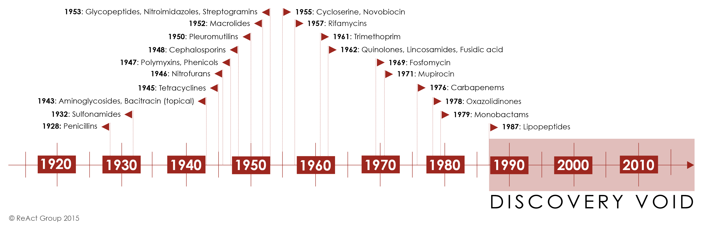{width="600"}

<figcaption>

**Figure 2. Antibiotic discovery timeline.** [Source ReACT Group 2015](https://www.reactgroup.org/).

</figcaption>

</figure>

 

Once antibiotic resistance develops, it can spread from one patient to another if appropriate hygienic precautions (e.g., hand hygiene of healthcare providers, isolation precautions of colonised patients) are not followed. The risk of resistant bacteria spreading is increased in crowded environments, especially when people in the surrounding area are receiving antibiotics - a common scenario in overcrowded hospitals or intensive care units.

The consequences of faltering antibiotic discovery are now being felt worldwide as more and more bacterial infections are becoming harder to treat. Especially worrisome is the lack of antibiotics against common Gram-negative bacteria (i.e. *Escherichia coli, Klebsiella pneumonia, Pseudomonas aeruginosa,* and *Acinetobacter baumannii*) that are increasingly resistant to all but last-line antibiotics. The rapid global spread of multi- and pan-resistant bacteria, also known in the lay press as "superbugs," can cause infections that are not treatable with existing antibiotics.

Follow this link to watch a YOUTUBE video of how quickly *Escherichia coli* can [develop resistance to ciprofloxacin.](https://www.youtube.com/watch?v=bDa4-nSc7J8)

## Global response to antimicrobial resistance (AMR) {.unnumbered}

Recognizing the growing threat of antibiotic resistance (AMR) to human health, economic and human development, The World Health Organization (WHO) and The Organisation for Animal Health (OIE) developed in 2001 a Global Plan for Containment of Antimicrobial Resistance that subsequently led to a [Global Action Plan for AMR](https://www.who.int/publications/i/item/9789241509763) in 2017 and more recently a ["Call to Action on Antimicrobial Resistance"](https://www.who.int/news/item/30-07-2021-call-to-action-on-antimicrobial-resistance-2021) in 2021. The plan outlines 21 strategies and 5 strategic actions that should be implemented in member states to address AMR. These include:

1.  Improvements in the awareness and understanding of antimicrobial resistance through effective communication, education and training.
2.  Strengthening of knowledge and evidence base of AMR through surveillance and research
3.  Reductions in the incidence of infection through effective sanitation, hygiene and infection prevention measures.
4.  Optimization the use of antimicrobial medicines in human and animal health
5.  Development of an economic case for sustainable investment in AMR research that takes account of the needs of all countries, and increase investment in new medicines, diagnostic tools, vaccines and other interventions.

The WHO also proposed a [*Priority Pathogen List*](https://www.who.int/medicines/publications/WHO-PPL-Short_Summary_25Feb-ET_NM_WHO.pdf)for research and development of new antibiotics and established a global antimicrobial use and surveillance program ([*Global Antimicrobial Surveillance systems-GLASS*](https://www.who.int/initiatives/glass)*)*. The priority pathogens list includes bacteria that are considered to be be the biggest threat to human health (besides *Mycobacterium tuberculosis,* which was already considered a priority pathogen). The WHO list breaks down pathogens into three groups:

<figure>

<figcaption>

**Table 1. WHO priority pathogens**

</figcaption>

+--------------+--------------------------------------------------------------------------------------------+
| Priority     | Pathogens included                                                                         |
+:=============+:===========================================================================================+
| **Critical** | *Acinetobacter baumannii* (Carbapenem-resistant)                                           |
|              |                                                                                            |
|              | *Pseudomonas aeruginosa* (Carbapenem-resistant)                                            |
|              |                                                                                            |
|              | Enterbacterales (3rd generation cephalosporin, carbapenem-resistant)                       |
+--------------+--------------------------------------------------------------------------------------------+
| **High**     | *Enterococcus faecium*, vancomycin-resistant                                               |
|              |                                                                                            |
|              | *Staphylococcus aureus*, methicillin-resistant, vancomycin intermediate and resistant      |
|              |                                                                                            |
|              | *Helicobacter pylori*, clarithromycin-resistant                                            |
|              |                                                                                            |
|              | *Campylobacter*, fluoroquinolone-resistant                                                 |
|              |                                                                                            |
|              | *Salmonella* spp., fluoroquinolone-resistant                                               |
|              |                                                                                            |
|              | *Neisseria gonorrhoeae*, 3rd generation cephalosporin-resistant, fluoroquinolone-resistant |
+--------------+--------------------------------------------------------------------------------------------+
| **Medium**   | *Streptococcus pneumoniae*, penicillin-non-susceptible                                     |
|              |                                                                                            |
|              | *Haemophilus influenzae*, ampicillin-resistant                                             |
|              |                                                                                            |
|              | *Shigella* spp., fluoroquinolone-resistant                                                 |
+--------------+--------------------------------------------------------------------------------------------+

</figure>

These pathogens may exhibit multi-drug resistance (MDR), extensive drug resistance (XDR) or pan-drug resistance (PDR). [@MagiorakosEtAl2012a] Difficult-to-treat resistance (DTR) is a newer definition used to define isolate resistance patterns that require the use of less-effective or more toxic "reserve" antibiotics- e.g., *Acinetobacter baumanii* susceptible only to nephrotoxic drugs like colistin and tobramycin.[@KadriEtAl2018a]

+--------------------------------------------------------------------------------------------------------------------------------------------------------------------------------------------------------------------------------------------------------------------+
| MDR- resistance to one agent in at least 3 antibiotic categories; XDR- resistant except to 2 or fewer antibiotic categories; PDR- resistant to all agents in all antibiotic categories; DTR-requires the use of less-effective or more toxic "reserve" antibiotics |
+--------------------------------------------------------------------------------------------------------------------------------------------------------------------------------------------------------------------------------------------------------------------+

 Currently, both the [WHO](https://apps.who.int/iris/bitstream/handle/10665/312266/9789241515528-eng.pdf) and [OIE](https://www.oie.int/en/what-we-do/global-initiatives/antimicrobial-resistance/#ui-id-4) have also developed lists of antibiotics that are considered of "critical importance" for human and animal medicine. These lists help establish priorities for antimicrobial resistance surveillance and new drug development.

## What are the drivers of antimicrobial resistance? {.unnumbered}

AMR is a natural phenomenon. Most antimicrobial drugs are naturally produced by micro-organisms, including environmental fungi and saprophytic bacteria, or are synthetic modifications of these natural products, with only a few drugs (e.g., sulphonamides and fluoroquinolones) being wholly synthetic. Yet AMR is accelerated by antimicrobial exposure in health care, agriculture, and the environment. Further transmission is affected by standards of infection control in healthcare settings, sanitation, access to clean water, access to assured quality antimicrobials and diagnostics, travel, and migration.

Antimicrobials are among the most commonly prescribed drugs used in human medicine, yet up to 50% of all antibiotic prescriptions are considered unnecessary. This use, misuse, or overuse of antimicrobial drugs is considered to be a major catalyst of increasing antimicrobial resistance. Globally, the use of antimicrobials is accelerating worldwide, particularly in LMICs as antimicrobials become readily accessible and affordable. The use of [*WHO Watch antibiotics*](https://www.who.int/news/item/01-10-2019-who-releases-the-2019-aware-classification-antibiotics) increased 90.0% worldwide and 165% in LMICs between 2000 and 2015. (See: [How can the effectiveness of antimicrobials be preserved?])

In medicine, the *density* per person of antibiotic prescribing might be highest in inpatient settings, with 30--40% of patients on antibiotics in European hospitals. However, the overall highest *quantity* of antimicrobial consumption is highest in the community setting.

More antimicrobials are used in food production than in human beings, with marked national differences in the number of antimicrobial drugs used in food producing animals. **It has been estimated that 73% of all antibiotic use per by weight is for food production.**[@VanBoeckelEtAl2017] Various studies have shown that antimicrobial resistance has, at least in part, emerged as a result of the selective pressure in veterinary medicine, food-animal and fish production, and agriculture. Therefore to effectively combat AMR, a multifaceted or *ONE-HEALTH* approach is required (See: *One-Health Perspective of AMR*).

<figure>

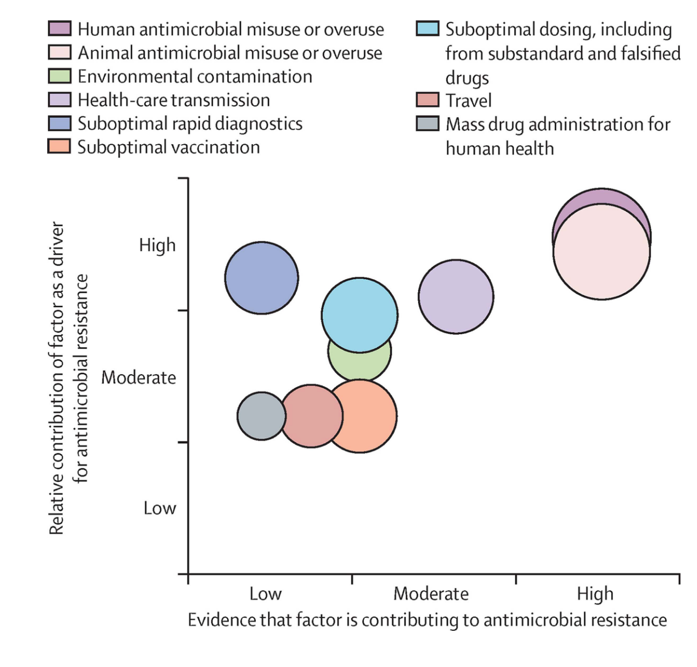{width="400"}

<figcaption>

**Figure 3. Modifiable risk factors that drive antimicrobial resistance**. Figure from Homes et al. [@HolmesEtAl2016b]

</figcaption>

</figure>

## AMR in Low-Middle Income Countries (LMICs) {.unnumbered}

AMR is a global problem, but its regional prevalence across the globe varies with antibiotic consumption, access to clean water and adequate sanitation, vaccination coverage, and access to quality healthcare. The latest WHO report, based on AMR data from 66 countries, illustrates an alarming picture of the global status of resistance as an increasing number of countries are now reporting high rates of resistance among antimicrobials used to treat common infections.

There are considerable knowledge gaps regarding AMR prevalence in LMICs that lack the same clinical and laboratory capacity and surveillance monitoring infrastructure. One systematic review noted that across Africa AMR data are lacking for 40% of the African countries.[@CenterforDiseaseDynamicsEconomicsandPolicy2021] In the Asia and Pacific region, South East Asia is estimated to have the highest risk of AMR emergence and spread, with the highly transferable New Delhi metallo-beta-lactamase-1 (NDM-1) as an example. Furthermore, China and India alone accounted for more than one-third of the global incidence of multidrug-resistant (MDR) tuberculosis.

COVID-19 has focused global attention on the inequitable access to the tools needed to control the pandemic, with high-income countries (HICs) and low- and middle-income countries (LMICs) at opposite ends of the scale (Discussed in more detail in Model 3). In the case of antibiotic resistance, a pandemic projected to cause four times more deaths per year than COVID-19 during 2020, inequity between HICs and LMICs remains a major problem.[@MendelsonEtAl2016]

\newpage

------------------------------------------------------------------------

**How is LMIC defined?** The World Bank defines lower middle income economies as countries where the per capita gross national income (GNI) falls between \$1,026 and \$3,955. The countries that are part of the upper MIC classification with a GNI that falls between \$3,956 and \$12,475.

Countries currently defined at LMICs include: Afghanistan, Albania, Algeria, Angola, Antigua and Barbuda, Argentina, Armenia, Azerbaijan, Bangladesh, Belarus, Belize, Benin, Bhutan, Bolivia, Bosnia and Herzegovina, Botswana, Brazil, Burkina Faso, Burundi, Cabo Verde, Cambodia, Cameroon, Central African Republic, Chad, China (People's Republic of), Colombia, Comoros, Democratic Republic of Congo, Congo, Costa Rica, Côte d'Ivoire, Cuba, Djibouti, Dominica, Dominican Republic, Ecuador, Egypt, El Salvador, Equatorial Guinea, Eritrea, Eswatini, Ethiopia, Fiji, Gabon, Gambia, Georgia, Ghana, Grenada, Guatemala, Guinea, Guinea-Bissau, Guyana, Haiti, Honduras, India, Indonesia, Iran, Iraq, Jamaica, Jordan, Kazakhstan, Kenya, Kiribati, Democratic People's Republic of Korea, Kosovo, Kyrgyzstan, Lao People's Democratic Republic, Lebanon, Lesotho, Liberia, Libya, North Macedonia, Madagascar, Malawi, Malaysia, Maldives, Mali, Marshall Islands, Mauritania, Mauritius, Mexico, Micronesia, Moldova, Mongolia, Montenegro, Montserrat, Morocco, Mozambique, Myanmar, Namibia, Nauru, Nepal, Nicaragua, Niger, Nigeria, Niue, Pakistan, Palau, Panama, Papua New Guinea, Paraguay, Peru, Philippines, Rwanda, Saint Helena, Samoa, São Tomé and Príncipe, Senegal, Serbia, Sierra Leone, Solomon Islands, Somalia, South Africa, South, Sudan, Sri Lanka, Saint Lucia, Saint Vincent and the Grenadines, Sudan, Suriname, Syrian Arab Republic, Tajikistan, Tanzania, Thailand, Timor-Leste, Togo, Tokelau, Tonga, Tunisia, Turkey, Turkmenistan, Tuvalu, Uganda, Ukraine, Uzbekistan, Vanuatu, Venezuela, Vietnam, Wallis and Futuna, West Bank and Gaza Strip, Yemen, Zambia, Zimbabwe

------------------------------------------------------------------------

LMICs are particularly susceptible to the emergence and rapid spread of AMR for several reasons:

-   High population density in some countries
-   Lack of access to clean water, suboptimal sewage systems, poor sanitation
-   Poorer healthcare infection control practices
-   Increasing consumption of antimicrobials in humans
-   Availability and distribution of poor-quality (counterfeit) medicines
-   Lack of regulation on antimicrobial use in farming, and pharmaceutical industry pollution

  The health and economic impact of AMR is also more severe and longer lasting in LMICs versus HICs. AMR is generally associated with:

-   Increased mortality and health costs

-   Antibiotics effective against AMR are more expensive and not affordable for many patients

-   Increasing use of antibiotics with efficacy against AMR leads to higher resistance to "last-line" antibiotics

    -   In fact, carbapenem consumption is increasing at a rapid pace in poor economies.[@KleinEtAl2021a]

    -   Lack of access to newer, expensive antibiotics needed to treat the increasing toll of MDR and XDR bacterial infections;

    -   Inequity in ability to provide the basic public health interventions that drive many of the social determinants of infectious diseases in LMICs

 

<figure>

{width="600"}

<figcaption>

**Figure 4. Progress on vaccinations by GDP per capita, circle size represents population. Source:** [Financial Times](https://www.ft.com/visual-and-data-journalism)

</figcaption>

</figure>

 

The singular effectiveness of access to clean **water, sanitation and hygiene ([WASH](https://www.who.int/health-topics/water-sanitation-and-hygiene-wash))** in preventing the spread of disease is well understood, yet billions of people around the world still lack access to these necessities.[@BurgmannEtAl2018]

-   Currently, 2.1 billion people live without access to safe drinking water and 4.5 billion people are without access to adequate sanitation.
-   Every day, 1300 children under 5 die from preventable diarrhoeal diseases, including cholera, caused by contaminated water and poor sanitation.
-   1 in 3 healthcare facilities lack soap and water or hand sanitizer where staff provide patient care. Billions of patients worldwide must rely on these facilities.
-   In some countries, up to 90% of women receive routine prophylactic antibiotics during childbirth, highlighting the conditions under which they are delivering their babies and what would cause the inevitability of infection

The cumulative lack of WASH adds up to populations not only getting unnecessarily sick---with the associated suffering, medical costs and loss of income or schooling---they are increasingly reliant on antibiotics to get better.[@Denny2021a] The challenge is that WASH is a public works solution for a public health problem. WASH is not a pill or 'quick fix'. It requires capital investment, system strengthening, and behaviour change to ensure that clean water and functional toilets are available and utilized day-in and day-out. These issues require a different set of skills than those possessed by medical and public health professionals.

Vaccination, a cornerstone of infection prevention and reducing the need for antibiotic use, is suboptimal in both HICs and LMICs. In 2019, global third-dose coverage for childhood pneumococcal vaccination in 149 member states was only 48%, and global rotavirus vaccine coverage was estimated at 39%. South Africa, middle-income country, procures less than 1 million doses of influenza vaccine for its annual influenza season, despite in excess of 10 million people being identified as "high-risk" and prioritized for vaccination.

Optimizing infection prevention on farms and making improvements to housing conditions and feed to reduce illness in animals is also critical to offset the need for antibiotics in food production animals. While there has been progress in the reduction of antibiotic use in farms in the EU, attention nor funding for such improvements in LMICs is absent. *It's one thing being told to reduce your antibiotic use in food production, it's another to have the means to do so, even for the most committed resource-poor farmer.*

<figure>

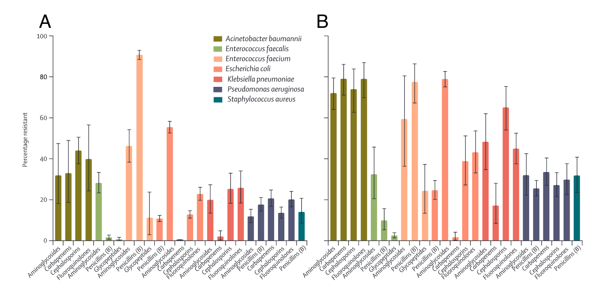{width="600"}

<figcaption>

**Figure 5. Global antibiotic use and resistance by income class.** (A) High-income countries (HICs); and (B) Low-Middle Income Countries (LMICs). [@CenterforDiseaseDynamicsEconomicsandPolicy2021]

</figcaption>

</figure>

<figure>

 

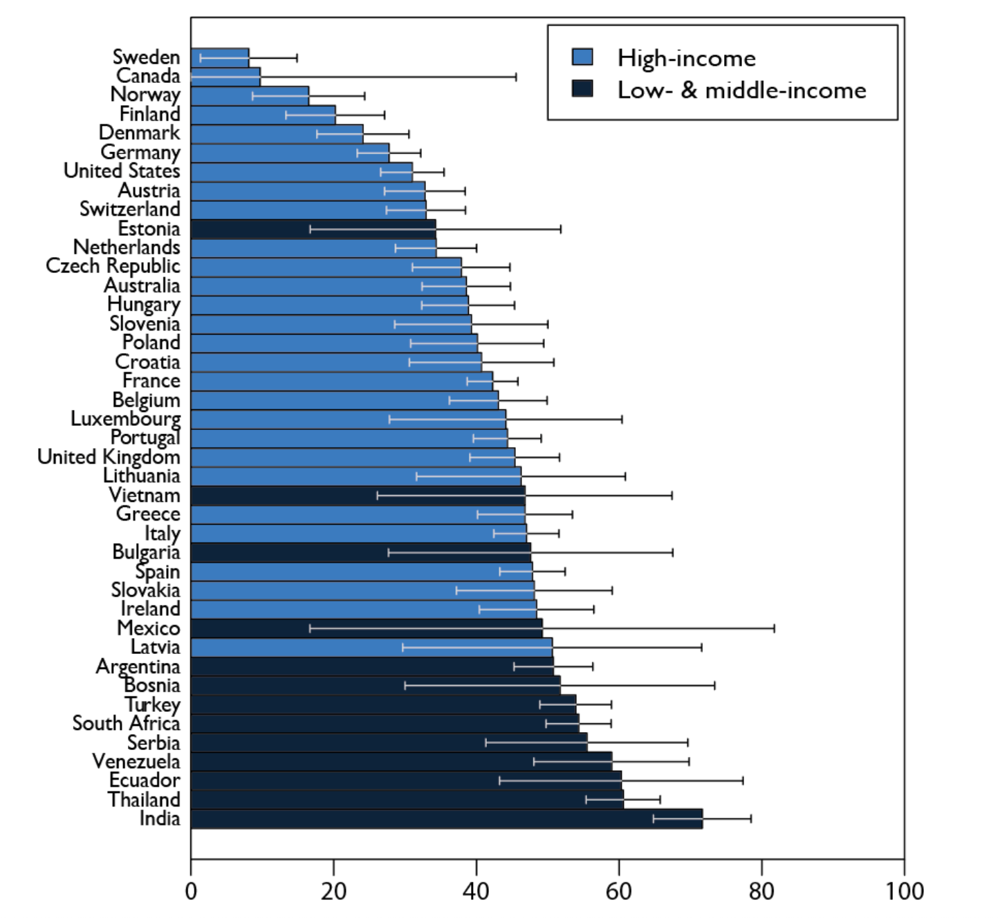{width="600"}

<figcaption>

**Figure 6. Drug resistance index (DRI) across countries**. The drug resistance index is a composite score derived by multiplying the proportion of each antibiotic used to treat a set of pathogens by the proportion of all isolates that were resistant to that drug. Blue bars represent high-income countries (HICs) dark blue bars represent low-middle income countries (LMICs).[@CenterforDiseaseDynamicsEconomicsandPolicy2021]

</figcaption>

</figure>

 

The international focus on awareness, surveillance, infection prevention, stewardship and research and development (R&D) of new antibiotics in encouraging, but is also widening the equity gap by pouring millions of dollars into research and development of new antibiotics and surveillance systems, while the interventions that could benefit LMICs the most, infection prevention, clean water, improved sanitation, has received a relatively few resources.

What are the possible solutions? Recently COVID-19 has refocused attention that in infectious diseases. The Access to COVID-19 Tools (ACT)-Accelerator that we will discuss in Model 3 has shown that financial contributions from HICs to a LMIC-pool can improve equitable access to diagnostics, therapeutics and vaccines, but it is conceivable that the same model could be broadened to encompass tools that would support major social change for AMR.

### How can the effectiveness of antimicrobials be preserved? {.unnumbered}

Strategies for the prevention and containment of AMR often focus on:

1.  Improvement of infection diagnosis and prescription practices (antimicrobial stewardship)
2.  Reduction of antimicrobial use in agriculture and environmental exposure
3.  Development of new antimicrobials
4.  Access to essential medicines of assured quality
5.  Improvement of AMR surveillance

Antimicrobial stewardship is a coordinated program that promotes and focuses on the appropriate use of antimicrobials and strategies to improve patient outcomes, reduces antimicrobial resistance, and seeks to decrease the spread of infections caused by multidrug-resistant organisms. These programs may be implemented through the use of institution-specific treatment guidelines and an antibiotic stewardship team (typically infectious diseases physicians with a clinical pharmacist) who carry out full-time activities to promote and encourage appropriate antibiotic use. While these programs have been shown to be successful in many academic hospitals, gaps remain in the knowledge of how to optimally design and sustain these programs. Stewardship programs are less frequently implemented in community settings where most antibiotic prescribing takes place.

{width="600"}

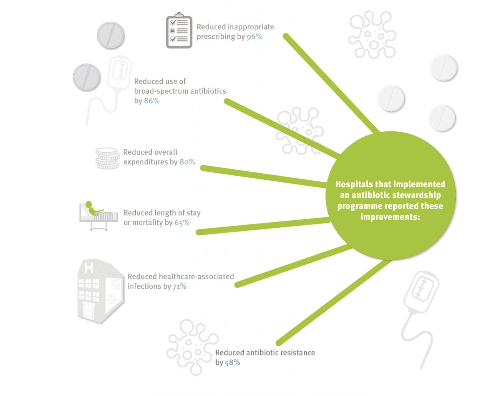{width="600"}

<figcaption>

**Figure 6. Examples of antimicrobial stewardship efforts and outcomes**. Source: [ECDC](https://antibiotic.ecdc.europa.eu/en/infographics-about-antibiotic-stewardship-programmes)

</figcaption>

</figure>

 Since 2017, the WHO has published the **AWaRe Antibiotic Classification Watch List** to support antibiotic stewardship efforts at local, national and global levels. The classification takes into account the impact of different antibiotics classes and clinical uses for predicting resistance potential, to emphasize the importance of their appropriate use.

**Antibiotics are classified into three groups: Access, Watch and Reserve.**

-   **The "Access" group includes** antibiotics that have activity against a wide range of commonly encountered susceptible pathogens while also showing lower resistance potential than antibiotics in the other groups. *Selected Access* group antibiotics are recommended as essential first or second choice empiric treatment options for infectious syndromes reviewed by the *Essential Medicines List (EML)* *Expert Committee* and are listed as individual medicines on the *WHO Model Lists of Essential Medicines*.

-   **The "Watch" group includes** antibiotic classes that have higher resistance potential and includes most of the highest priority agents among the *Critically Important Antimicrobials for Human Medicine* and/or antibiotics that are at relatively high risk of selection of bacterial resistance. These medicines should be prioritized as key targets of stewardship programs and monitoring. Selected Watch group antibiotics are recommended as essential first or second choice empiric treatment options for a limited number of specific infectious syndromes and are listed as individual medicines on the *WHO Model Lists of Essential Medicines*.

-   **The "Reserve" group includes** includes antibiotics and antibiotic classes that should be reserved for treatment of confirmed or suspected infections due to multi-drug-resistant organisms. Reserve group antibiotics should be treated as "last resort" options.

    -   Selected Reserve group antibiotics are listed as individual medicines on the *WHO Model Lists of Essential Medicines* when they have a favourable risk-benefit profile and proven activity against "Critical Priority" or "High Priority" pathogens identified by the *WHO Priority Pathogens List*, notably carbapenem resistant Enterobacteriaceae. These antibiotics should be accessible, but their use should be tailored to highly specific patients and settings, when all alternatives have failed or are not suitable. These medicines could be protected and prioritized as key targets of national and international stewardship programs involving monitoring and utilization reporting, to preserve their effectiveness.

-   Finally, the list includes **"Not-recommended" antibiotics**- fixed-dose combinations of multiple broad-spectrum antibiotics listed here is not evidence-based, nor recommended in high-quality international guidelines. WHO does not recommend their use in clinical practice.

The 2021 update of the AWaRe classification includes an additional 78 antibiotics not previously classified, bringing the total to 258.

The AWaRe tool is useful for monitoring antibiotic consumption, defining targets and monitoring the effects of stewardship policies that aim to optimize antibiotic use and curb antimicrobial resistance. **The WHO 13^th^ General Programme of Work 2019--2023 includes a country-level target of at least 60% of total antibiotic consumption limited to *Access Group* antibiotics.**

### Case study: A successful national antibiotic stewardship program in a LMIC {.unnumbered}

The Antibiotics Smart Use (ASU) program in Thailand is considered one of the most successful examples of community antimicrobial stewardship in a LMIC. The focus of the program was to specifically reduce the use of antibiotics in the treatment of non-bacterial infections. ASU started by trying to reduce unnecessary antibiotic use in patients with 3 conditions: upper respiratory tract infections, especially common colds with sore throat; acute diarrhea and simple wounds.

In the beginning, ASU consisted of a network of researchers from Thailand's Ministry of Public Health and pharmacists and doctors from Srinakharinwirot University and Chulalongkorn University.

-   **In phase 1 (2007- 2008)** they piloted educational and training reforms to improve prescribing in 10 hospitals and 87 primary health centres in one province. Antibiotic prescription, provider attitudes of effectiveness and knowledge of antibiotics, non-prescription rates in case of non-bacterial infections, and patient health and satisfaction were monitored.

-   **In** **phase 2** **(2008-2009)** the same indicators were used to scale up the program to three provinces and two hospital networks, counting to 44 hospitals and 621 primary health care centres.

-   **In phase 3** **(2010 -- Present)** the focus is on long-term sustainability and nationwide scale up of ASU -- initially to 22 hospital networks in 15 provinces, and then subsequently across the entire country.

<figcaption>

**Table 2. Key Phases of the Thai Antibiotic Smart Use Program.** Table is from Jit et al 2021. [@JitEtAl2021]

</figcaption>

</figure>

+----------------------+------------------------------------------------------------------------+------------------------------------------------------------+---------------------------------------------------+
| Area                 | Phase 1\                                                               | Phase 2\                                                   | Phase 3,\                                         |
|                      | (1 year)                                                               | (1 year, 3 months)                                         | transition period                                 |
+:=====================+:=======================================================================+:===========================================================+:==================================================+
| **Goals**            | Test effectiveness of ASU in changing antibiotic prescription behavior | Test feasibility of scaling up ASU model                   | Strengthen networks, assess scaling up mechanisms |
+----------------------+------------------------------------------------------------------------+------------------------------------------------------------+---------------------------------------------------+
| **Target**           | 1 province                                                             | 3 provinces and 2 networks of public and private hospitals | 22 hospital networks in 15 provinces              |
+----------------------+------------------------------------------------------------------------+------------------------------------------------------------+---------------------------------------------------+
| **Funding\           | WHO, Thai FDA                                                          | HSRI, NHSO, Thai FDA                                       | DSMDC, Thai FDA                                   |
| agencies**           |                                                                        |                                                            |                                                   |
+----------------------+------------------------------------------------------------------------+------------------------------------------------------------+---------------------------------------------------+
| **Agencies**         | Thai FDA                                                               | Thai FDA                                                   | DSMDC, Thai FDA, IHPP                             |
+----------------------+------------------------------------------------------------------------+------------------------------------------------------------+---------------------------------------------------+
| **Budget spending**  | US\$ 33,000                                                            | US\$ 73,000                                                | US\$ 123,000                                      |
+----------------------+------------------------------------------------------------------------+------------------------------------------------------------+---------------------------------------------------+
| **Spillover effect** | No                                                                     | Yes                                                        | Yes                                               |
+----------------------+------------------------------------------------------------------------+------------------------------------------------------------+---------------------------------------------------+

HSRI- Health Sciences Research Institute, NHSO-Thailand National Health Security Office, DSMDC- ThaiDrug System Monitoring and Development Centre, IHPP- International Health policy Program (Thailand)

The program also had many simple but innovative community health interventions. For example, holding up a simple concave mirror for consumers asking to buy antibiotics in pharmacies for treating the common cold and cough symptoms caused by viruses allowed the patients to make a "self-diagnosis" of why antibiotics are probably not needed.

 

<figure>

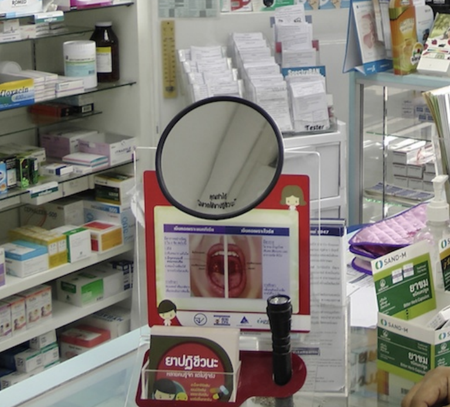{width="600"}

<figcaption>

**Figure 7. Mirror toolkit for patients to self-assess their sore throat symptoms in Thai Pharmacies**

</figcaption>

</figure>

  After completion of Phases 1-2, the following results were noted:

-   *Positive effects on reducing antibiotic prescribing*. Antibiotic use was reduced by 18-46%
-   The percentage of patients who did not receive antibiotics increased by 29.1%, whereas there was no change in the control groups who were not involved in the ASU program
-   *Patient health and satisfaction* *rates were high*, 96%-99.3% of patients surveyed who did not receive antibiotics recovered and felt better within 7-10 days after their medical visits
-   *Success in scaling up*. The number of hospitals adopting ASU increased from 44 hospitals (2008) to more than 600 hospitals (2010).

The ASU project is having an impact beyond the borders of Thailand too and is now seen as a model for replication in other parts of south-east Asia with interest elicited from as far away as Africa and Latin America. Read more about the ASU project at [react.org](https://www.reactgroup.org/toolbox/rational-use/examples-from-the-field/antibiotics-smart-use-thailand/)

## AMR situation in Italy {.unnumbered}

Southern Europe, including Italy, has among the highest rates of resistance for pathogens included on the WHO Priority Pathogen list. For example, surveillance data from the European Centres for Disease Control (ECDC) have reported a dramatic increase in multidrug-resistance (MDR) in Italy since 2009, with now more than one-third of *Klebsiella pneumoniae* resistant to previously-considered last-line antibiotics such as carbapenems. An interactive ECDC resistance atlas showing differences in resistance rates between countries for common antibiotics can be found at the ECDC website. Similarly, the Italian Antimicrobial Surveillance system ([Micronet Resistance Surveillance](https://www.epicentro.iss.it/antibiotico-resistenza/epidemiologia-italia)) has reported:

-   26.4% of *Escherichia coli* are resistant to 3rd generation cephalosporins
-   29.5% of *Klebsiella pneumoniae* are resistant to carbapenems (including 33.1% resistant to multiple drug classes)
-   15.9% of *Pseudomonas aeruginosa* are resistant to carbapenems
-   80.8% of *Acinetobacter* spp. are resistant to carbapenems with 78.8% of species resistant to multiple drug classes
-   For the Gram-positive bacterium *Staphylococcus aureus*, the percentage of methicillin-resistant isolates (MRSA) remained stable, around 34%, while the percentage of *Enterococcus faecium isolates* resistant to vancomycin in 2020 was equal at 23.6%
-   For *Streptococcus pneumoniae* there was a slight increase in both the percentage of isolates resistant to penicillin (13.6%) and those resistant to erythromycin (24.5%).
-   Overall, higher antimicrobial resistance rates (around 40%) are observed in ICUs versus general medical wards for both carbapenem-resistant *K. pneumoniae* and methicillin-resistant *S. aureus*.

<figure>

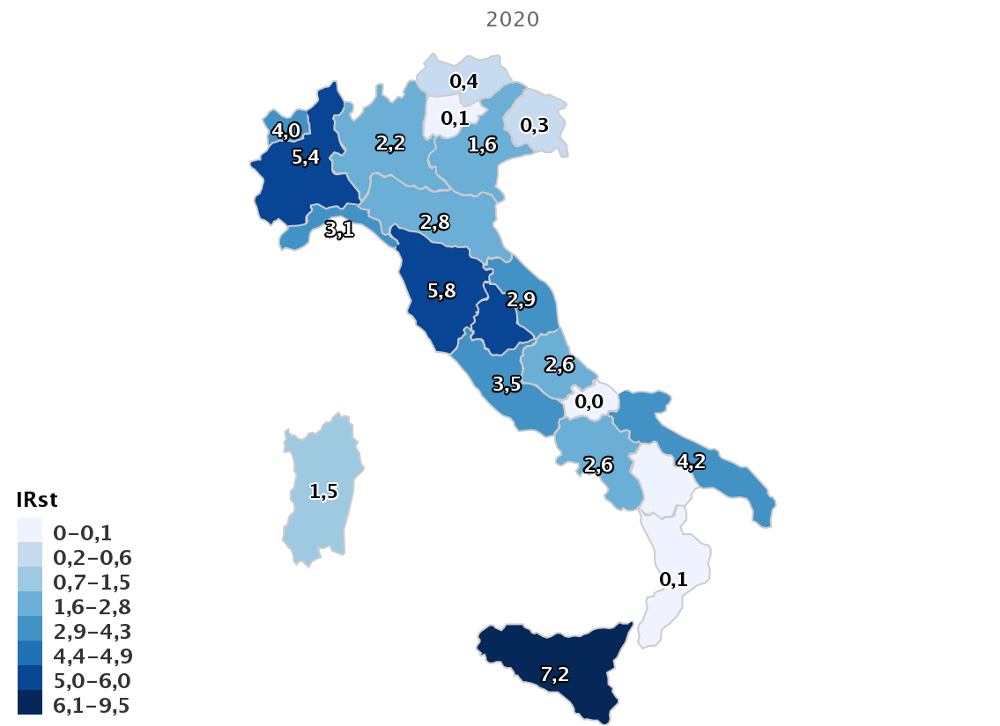{width="600"}

<figcaption>

**Figure 8. Regional differences in carbapenem-resistant Enterobacterales (CRE) bloodstream infection- 2020 incidence per 100,000 residents in Italy.** Source Micronet Resistance Surveillance Program

</figcaption>

</figure>

  In 2017, a [report](https://www.ecdc.europa.eu/en/publications-data/ecdc-country-visit-italy-discuss-antimicrobial-resistance-issues) by the the ECDC noted that the AMR situation in Italian hospitals and regions poses a major public health threat to the country. The levels of carbapenem-resistant Enterobacteriaceae (Enterobacterales) (CRE) and *Acinetobacter baumannii* have now reached hyperendemic levels in many hospitals. Together with increasing methicillin-resistance among the Gram-positive species *Staphylococcus aureus* (MRSA), **these resistance trends have lead to Italy's ranking as one of the Member States with one of the highest level of antibiotic resistance in Europe.** Factors noted by the ECDC that contributed negatively to the poor control of antibiotic resistance in Italy include:

-   Little sense of urgency about the current AMR situation from most stakeholders and a tendency by many stakeholders to avoid taking charge of the problem
-   Lack of institutional support at national, regional and local level
-   Lack of professional leadership at each level
-   Lack of accountability at each level
-   Lack of coordination of the activities between and within levels.

## The global future of AMR {.unnumbered}

-   Drug-resistant infections already cause at least 700,000 deaths globally a year, including 230,000 deaths from multidrug-resistant tuberculosis. **The estimated total number of deaths due to AMR could climb to 10 million deaths globally per year by 2050 under current projections.**
-   Increasing resistance could lead to an unthinkable future of untreatable infections, reversing more than a 100 years of medical progress. Routine medical procedures or surgery will become more dangerous and associated with higher complication rates. Immunosuppression, cancer chemotherapy and transplantation may carry unacceptable risk for many patients if infections cannot be effectively prevented and treated.
-   Economic and social progress in many countries will be dramatically impacted by increasing AMR leading to political and social instability. The initial short-term economic damage of uncontrolled antimicrobial resistance will be comparable to the economic shocks experienced during the 2008-2009 global financial crisis and result in dramatically-increased healthcare expenditures; reductions in food and feed production, reduced economic output, and [increased poverty and inequality](https://documents.worldbank.org/en/publication/documents-reports/documentdetail/323311493396993758/final-report). The economic impact of antimicrobial resistance is predicted to be even greater and longer lasting on low-and middle-income (LMIC) countries.

<figure>

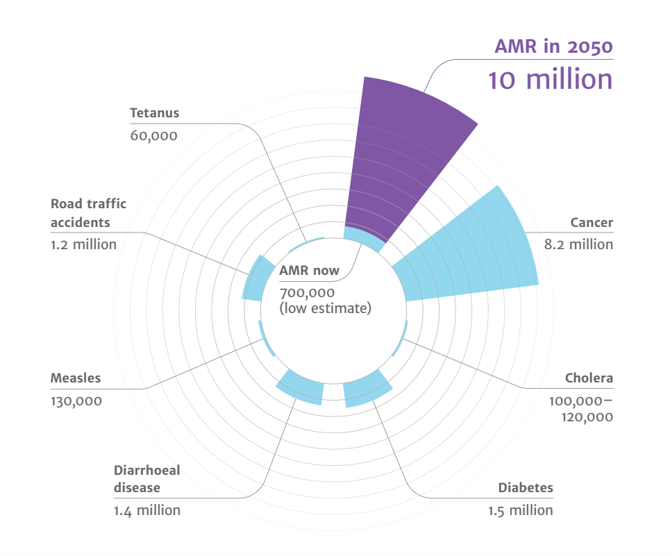{width="600"}

<figcaption>

**Figure 9. Projected deaths due to antimicrobial resistance in 2050.** Source: O'Neil Report.

</figcaption>

</figure>

## One-Health Perspective of AMR {.unnumbered}

Because the drivers of antimicrobial resistance lie in humans, animals, plants, food and the environment, a sustained One Health response is essential to engage and unite all health and environmental sectors around a shared vision and goals. **"One Health" refers to designing and implementing programmes, policies, legislation and research in a way that enables multiple groups engaged in human, terrestrial and aquatic animal and plant health, food and feed production and the environment to communicate and work together to achieve better public health outcomes.**

 

<figure>

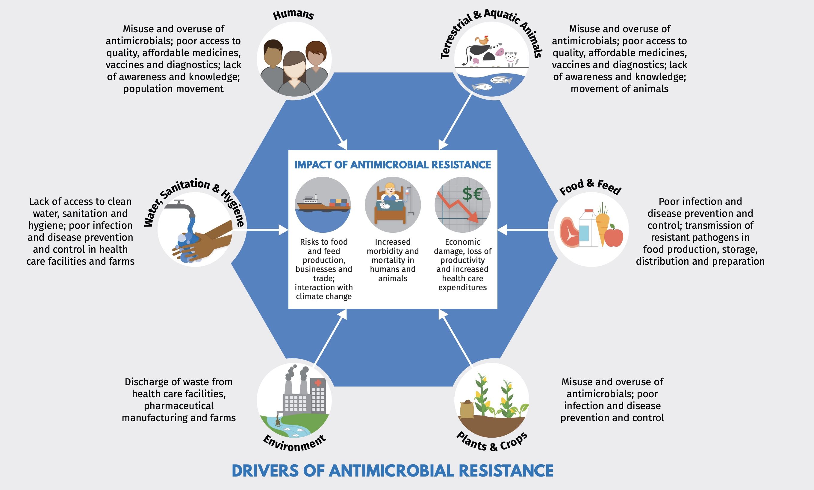{width="600"}

<figcaption>

**Figure 10. Elements for "One-Health Model" for addressing AMR**. Source: WHO

</figcaption>

</figure>

### Antibiotic use in animal food production {.unnumbered}

Few antimicrobial classes are reserved exclusively for humans. The vast majority of antibiotics are used both in humans and animals, including domestic mammals, birds, farmed fish and shellfish, honeybees and others. As noted earlier, **73% of all antibiotic consumption per weight is used for food production in animals.** [@VanBoeckelEtAl2019] Critically, two-third of all human infectious diseases that have emerged or re-emerged in recent decades are zoonotic-i.e. they originated in animals.[@WoolhouseGowtage-Sequeria2005] Therefore the transmission of antibiotic resistance from the foodchain to humans is a major health concern.

In horticulture, tetracyclines, streptomycin, and other antimicrobials are used for the prophylaxis and treatment of bacterial infections that affect plants (e.g., "fire blight" caused by *Erwinea amylovora* afflicting apple and pear trees).

In veterinary medicine, there are major differences in the way antibiotics are used for companion animals (e.g., dogs, cats, pet birds, horses) versus food-producing animals. Antibiotic use in companion animals is broadly similar to humans for the treatment of infections or in select cases prophylaxis, such as post-surgery. In the case of food production, if some animals are infected, antibiotics may be administered through feed or water to the entire group for reasons of practicality or efficiency. ***Metaphylaxis is a term used to describe therapeutic/prophylaxis antibiotic treatment at a group level.***

The most controversial type of group treatment in food animals is long-term, low-dose mass antibiotic treatment for purposes of growth promotion. This practice has a high propensity to select for antimicrobial resistance and is driven by economic factors rather than treatment of clinical infection. The practice was banned by the EU in 2006, but still continues in some countries such as the United States and China.

 

<figure>

{width="600"}

<figcaption>

**Figure 11. Pigs in cages, Quanzhou, China.** As the largest consumer of veterinary antimicrobials, China is critical for combating antimicrobial resistance (AMR). From Van Boekel et al.[@VanBoeckelEtAl2017]

</figcaption>

</figure>

 

The reported benefits of using antibiotics for growth promotion is controversial and supportive data in terms of weight gain is questionable (1-10%). Concerns have been expressed that antimicrobial growth promoters are often used to compensate for poor hygiene/housing conditions and appropriate healthy veterinary care.[@McEwenCollignon2018]

Unfortunately, use of antibiotic for growth promotion has increased dramatically with increasing meat-based diets. Since 2000, meat production has plateaued in high-income countries but has grown by 68%, 64%, and 40% in Africa, Asia, and South America, respectively.[@VanBoeckelEtAl2017] The transition to high-protein diets in low- and middle-income countries (LMICs) has been facilitated by the global expansion of intensive animal production systems, in which antimicrobials are used routinely to maintain health and productivity.

There are 4 factors that typically determine the health of animals, (e.g., chickens):

1.  The genetic stock of the animals
2.  Adequate nutrition
3.  Hygiene of living conditions
4.  Adequate veterinary care

While antibiotics may be able to improve deficiencies in one area, if multiple aspects of animal care are missing then antimicrobial resistance is unlikely to improve animal health or growth. **Thus, antimicrobials are often poor surrogates for good hygiene on farms.** Ideally, a key goal to reduce antibiotic use in animals is to further strengthen the 4 non-antibiotic aspects that are important to animal health so antibiotic use can be avoided.

Historically, governmental regulations have focused on toxicological dose-response data and the presence of antimicrobial residues in animal tissue, milk or other edible products (i.e. eggs) from treated animals - *so called minimum residue levels (MRLs) compatible with acceptable risk in humans.* While MRLs are well-understood and enforced with testing programs and penalties, these programs do not take into account selection of antimicrobial-resistant pathogens.

The WHO has advocated for the termination of using antimicrobials for growth promotion. A recent [report from the ECDC](https://www.ecdc.europa.eu/sites/default/files/documents/JIACRA-III-Antimicrobial-Consumption-and-Resistance-in-Bacteria-from-Humans-and-Animals.pdf) has suggested some progress in addressing this problem. Using surveillance data from 2017, the EU/EEA population mean antibiotic consumption in the 29 countries was 130 mg per kg of estimated biomass in humans and 108.3 mg per kg in food-producing animals. *This first time since the agencies began publishing the joint reports in 2011 that antibiotic use in humans has exceeded use in livestock.* Consumption of third- and fourth-generation cephalosporins, fluoroquinolones, and aminopenicillins was considerably higher in human medicine, while consumption of macrolides was similar, and consumption of tetracyclines and polymyxins was significantly higher in food-producing animals.

In 2022, new [EU legislation](https://eur-lex.europa.eu/legal-content/EN/TXT/PDF/?uri=CELEX:32019R0006&from=EN) will prohibit all forms of routine antibiotic use in farming, including preventative group treatments and medicated feeding except in extraordinary circumstances.

<figure>

{width="600"}

<figcaption>

**Figure 12. Antibiotic use in livestock reported in 2010.** Source: Our World in Data.

</figcaption>

</figure>

### The impact of animal antibiotic use on human AMR {.unnumbered}

#### Case study-cephalosporins:

Third generation cephalosporins (ceftotaxime, ceftriaxone) are widely used for serious infections in humans, including the treatment of urinary tract, abdominal, lung and bloodstream infections. These antibiotics are classified as "critically-important" for human health ([WHO AGISAR](http://www.agisar.org/)). Ceftiofur, cefpodoxime, and cefoperazone are similar cephalosporins approved for treating bacterial infections in food-producing animals including chickens and cattle.

Resistance to 3rd generation cephalosporins is mediated by extended-spectrum beta-lactamases (ESBLs) and AmpC enzymes. ESBL genes are transmitted on plasmids, transposons and other mobile genetic elements that can spread horizontally (surrounding bacteria and different bacterial species) and vertically (to daughter cells through replication). In recent years, growing resistance to 3rd generation cephalosporins in clinical medicine has become so common among *Escherichia coli* and *Klebsiella pneumonia* that many common infections are now routinely treated first-line with previously "last-line" antibiotics as carbapenems.

A number of studies comparing isolates from animals, food samples, and human infections have found a high genetic similarity or clonal isolates that carry the same ESBL genes and plasmids colonizing animals used for food production and isolates causing clinical infections in patients.[@LazarusEtAl2015]

In some chicken-producing enterprises, ceftiofur is injected in small quantities to hatching eggs or chicks as metaphylaxis for *Escherichia coli* infections and/or yolk sac infections.[@McEwenCollignon2018] This practice has been shown to select for cephalosporin resistance in *Salmonella enterica* serovar Heidelberg- an important cause of severe human illness (salmonella infection) linked to consumption of contaminated poultry products.[@SmithEtAl2008a]

<figure>

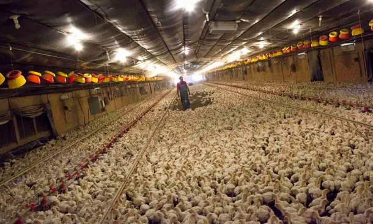{width="600"}

<figcaption>

**Figure 13. Chicken farm in the United States of America.** Image source: The Guardian

</figcaption>

</figure>

An example of the link between ceftiofur metaphylaxis and infections in humans is illustrated by experience from Canada. Studies conducted by the Canadian Integrated Program for Antimicrobial Resistance Surveillance detected a high degree of temporal correlation in trends of resistance to ceftiofur and ceftriaxone (a drug of choice for the treatment of severe cases of salmonelloses in children and pregnant women) from *Salmonella* Heidelberg strains isolated from patients with clinical infections and poultry samples collected at retail stores.[@Canada2009] Voluntary termination of ceftiofur metaphylaxis in hatcheries in the province of Quebec was followed by a precipitous drop in the prevalence of resistance to ceftiofur; subsequent reintroduction of ceftiofur in a more limited way was followed by a return to higher levels of resistance in *Salmonella* strains.

<figure>

</figure>

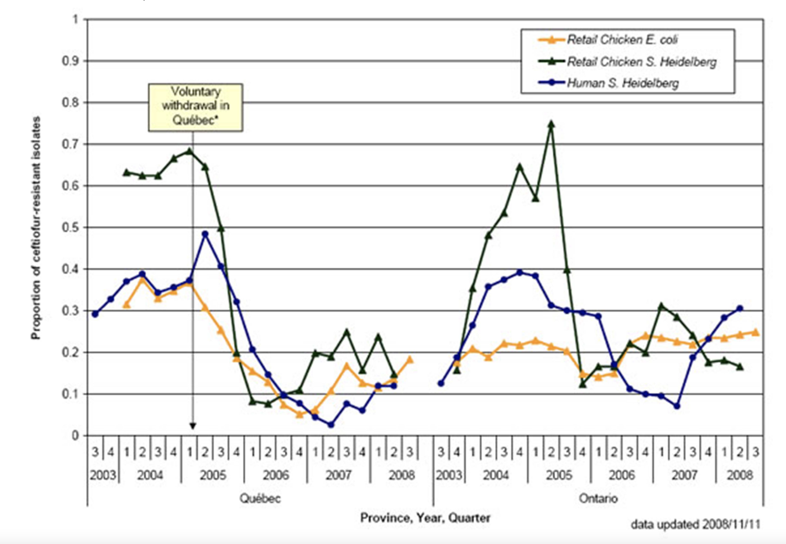{width="600"}

<figcaption>

**Figure 14. Ceftiofur resistance in chicken and human *Salmonella* Heidelberg and chicken *E. coli*.** [@Canada2009]

</figcaption>

</figure>

In Japan, voluntary withdrawal of the off-label use of ceftiofur in hatcheries in 2012 was also associated with significant decrease in broad-spectrum cephalosporin resistance in *E. coli* from chickens prepared for cooking. Some other countries (e.g., Denmark) have placed voluntary restrictions on ceftiofur use. The label claim for day-old injection of poultry flocks was withdrawn in Europe, while some countries have banned off-label use of third-generation cephalosporins, and in other countries there is a requirement that use be restricted to situations where no other effective approved drugs are available for treatment.

**These examples illustrate the danger of using antibiotics for metaphylaxis in animals from the same class as antibiotics used to treat infections in humans.** Similar links between antibiotic metaphylaxis and resistance in human infections have been reported for fluoroquinolones antibiotics with *Campylobacter jejuni.*[@EndtzEtAl1991a]

#### Case study- colistin: {.unnumbered}

Colistin is a member of the polymixin class of antibiotics, which have been used in both human and veterinary medicine for over 50 years. Until relatively recently, polymyxin antibiotics were rarely prescribed beyond topical or inhalational therapy in rare cases because of dose-limiting neurotoxicity and nephrotoxicity of the drugs.

**The use of intravenous colistin has surged in the last decade as a last-line antibiotic for carbapenem-resistant *Pseudomonas aeruginosa*, *Acinetobacter baumannii* and *Klebsiella pneumoniae.*** Even as human use has increased, colistin continues to be used in Brazil, Europe and China as a growth promoting and antibiotic treatment for pigs, poultry and calves.

-   In 2014, colistin use in EU member states in animals was higher than humans with a reported 485 tonnes- 99.7% in oral form or oral medicated feed. In China, with the world's largest production of pigs and poultry, an estimated 12,000 tonnes of colistin was used in the food production industry. [@LiuEtAl2016b]

-   In 2015, Lui and colleagues reported plasmid-mediated colistin-resistance gene, *mcr-1*, in *Escherichia coli* isolates obtained from animals, food and human bloodstream infections in China. [@LiuEtAl2016b] Alarmingly, the resistance gene has also been detected in 5% of healthy travellers from China in other parts of the world.[@LaxminarayanEtAl2013a]

-   The *mcr-1* gene has also been detected in isolates obtained from wildlife and surface water samples, demonstrating environmental contamination.[@ZurfuhEtAl]

-   Additional plasmid-mediated colistin-resistance genes have been reported in many other bacterial species and countries, including *mcr-2* from pigs in Belgium, and *mcr-3,4,5* in other countries.[@BorowiakEtAl2017]

-   Colistin illustrates important *One-Health Dimensions* *of AMR* that differ from third generation cephalosporins.[@FrostEtAl2019] Use of large quantities of colistin for group treatment or growth promotion in animals has probably lead to antimicrobial resistance problems in human health, even through colistin was considered in the past to be less important because other less toxic treatments were still available.

-   In 2017, China banned the use of colistin as a food additive for animals. Colistin is currently not approved as a food additive in Europe or the United States, but is still be used in LMICs as a growth promoting agent because of its low cost.

### Antimicrobial resistance in animals in LMICs {.unnumbered}

Many farmers in LMICs are sustenance farmers, and their livelihood is at stake if an animal becomes ill. Therefore, they may not have the resources for optimally nutritious feed and housing space/conditions. These challenges, combined with looser regulations on veterinary drugs, lead to often liberal use of antibiotic in animal feed to ensure animal health.[@VanBoeckelEtAl2017]

<figure>

{width="600"}

<figcaption>

**Figure 15. Global hotspots of antimicrobial resistance in animals.** Data source [resistancebank.org](https://resistancebank.org/)

</figcaption>

</figure>

The largest hotspots of AMR in animals were in Asia and India. Asia is home to 56% of the world's pigs and 54% of the chickens. Other growing hotspots of AMR are found in central India and Kenya, where resistance to multiple drugs has appeared but not yet reached 50%.

These data suggest that in areas such as Asia, targeted interventions such as legislative action and subsidies to improve farm hygiene could reduce the need for antimicrobials in animal production, thereby preserving important drugs for human medicine and the treatment of sick animals. In these regions, meat consumption is still low, but animal production is gradually increasing. Here, there may be a window of opportunity to contain AMR by imposing strict hygiene standards in newly built farms. This approach could reduce the risk of the spread of resistant pathogens such as *mcr* 1--carrying *E. coli* that have emerged in regions where intensive meat production has been facilitated by enormous quantities of veterinary antimicrobials.

In Africa, resistance maps reveal the absence of major AMR hotspots, except for the Johannesburg metropolitan area. This suggests, on the basis of the regions surveyed, that Africa probably bears proportionately less of the current global burden of AMR than high- and upper- to middle income countries. Policy-makers coordinating an international response to AMR might therefore spare Africa from the most aggressive measures, which may undermine livestock-based economic development and rightfully be perceived as unfair.

Clearly the the transition to sustainable animal production in both HIC and LMICs with improvements in farm-level biosafety and biosecurity are essential to reduce the future risk of AMR.

+----------------------------------------------------------------------------------------------------------------------------------------------------------------------------------------------------------------------------------------------------------------------------------------------------------------------------------------------------------------------------------------+
| **For further study:** In the 1990s avoparcin, a glycopeptide antimicrobial, was widely used in growth promotion in pigs and poultry production that was not initially thought to be of public health importance. Surveillance and research were eventually able to show that avoparcin use in animals contributed to the selection and wide dissemination of what type of resistance? |
+----------------------------------------------------------------------------------------------------------------------------------------------------------------------------------------------------------------------------------------------------------------------------------------------------------------------------------------------------------------------------------------+

### Environmental concerns {.unnumbered}

One Health considers possible environmental drivers of AMR in additional to human and animal health.[@McEwenCollignon2018] Many resistance mechanisms such as beta-lactamases are millions of years old and pre-date antibiotics. Soil and other environmental sources are rich sources of highly-diverse populations of bacteria and genes.

Antimicrobial resistance to a wide variety of drugs has been demonstrated in environmental bacteria isolated from the pre-antibiotic era, as well as from various sites on every continent free of other sources of exposure to modern antimicrobials. **Yet there is abundant evidence that human antibiotic use is having an impact on the *resistome*- the totality of or resistance genes in the total environment**.[@ONeilJim2015]

**Hundreds of thousands of tonnes of antimicrobials are produced annually and find their way into the environment. Waste from treatment plants and the pharmaceutical industry, if inadequately treated, can release high concentrations of antimicrobials into surface water.** Residues and metabolites of antimicrobials are constituents of human sewage, livestock manure, and aquaculture, along with fecal bacteria and resistance genes. Sewage treatment and composting of manure reduce concentrations of some, but not all antimicrobials and micro-organisms, which are introduced to soil upon land application of human and animal bio-solids.[@RahubeEtAl2016]

-   In developed countries with good-quality sewage and drinking water treatment, and where most people have little to no direct contact with food-producing animals, transmission of bacteria and resistance genes from agricultural sources is largely foodborne, either from direct contamination of meat and poultry during slaughter and processing, or indirectly from fruit and vegetables contaminated by manure or irrigation water.
-   In countries with poor sewage and water treatment, drinking water is likely to be very important in the transmission of resistant bacteria and/or genes from animals. Poor sanitation also facilitates indirect person-person water-borne transmission of enteric bacteria among residents as well as international travellers who return home colonized with resistant bacteria acquired locally.
-   Through these and other means, including globalized trade in animals and food and long-distance migratory patterns of wildlife can spread AMR worldwide rapidly.

General measures to address antimicrobial resistance in the wider environment include improved controls on pollution from industrial, residential, and agricultural sources. Improved research as well as environmental monitoring and risk assessment are also required to better understand the role of the environment in the selection and spread of antimicrobial resistance, and to identify more effective strategies to address resistance in this sector.

</figure>

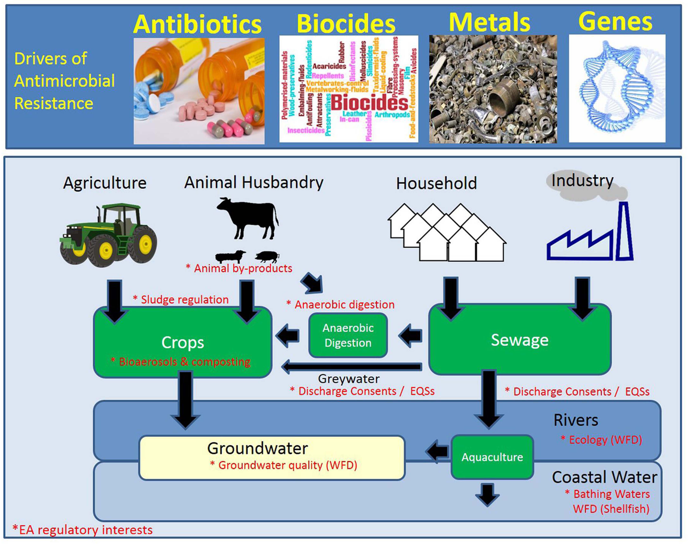{width="600"}

<figcaption>

**Figure 16. Hotspots of antimicrobial resistance.** Figure is from Singer et al. [@Singer2016]

</figcaption>

</figure>

\newpage

## Cross-border spread of AMR {.unnumbered}

<figure>

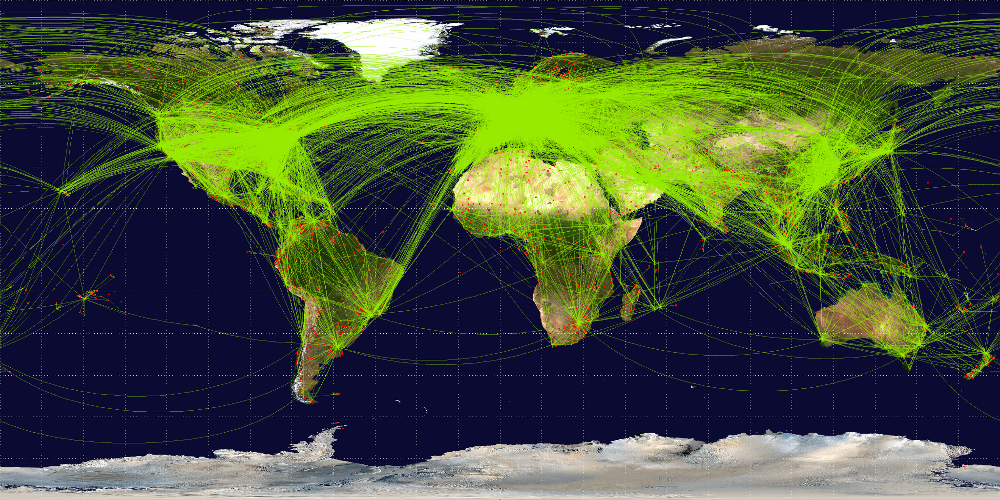{width="600"}

<figcaption>

**Figure 17. World airline travel routes in 2014.** Photo credit Jpatokal/Wikimedia (CC BY-SA 2.5)

</figcaption>

</figure>

The COVID-19 pandemic has exposed the limitations of global collaboration and response within existing global health frameworks, pointing to a clear need for more rules-based global governance to be able to effectively prevent, prepare and respond to health emergencies in a more just equitable way. However, valuable lessons from COVID-19 pandemic could enhance actions against AMR. Clearly, actions taken by one country have had substantial consequences for others. Governments should significantly bolster global and national capacity to prevent and respond to global cross-border health threats more broadly.

<figcaption>

**Table 3. Global successes and shortcomings in the multilateral response to the COVID-19 pandemic.** Table is from Jit et al 2021. [@JitEtAl2021]

 

</figcaption>

</figure>

+----------------------------------------------------+-----------------------------------------------------------------------------------------------------------------------------------------------+--------------------------------------------------------------------------------------------------------------------+
| Domain                                             | Successes                                                                                                                                     | Shortcomings illustrated by COVID-19 pandemic                                                                      |
+:===================================================+:==============================================================================================================================================+:===================================================================================================================+
| **Research collaboration and information sharing** | -   Sharing of information by researchers                                                                                                     | -   Many regions and countries slow to learn policy lessons from elsewhere                                         |
|                                                    |                                                                                                                                               |                                                                                                                    |
|                                                    | -   International research collaborations                                                                                                     | -   Lack of systemic global research governance                                                                    |
|                                                    |                                                                                                                                               |                                                                                                                    |
|                                                    | -   Public data repositories                                                                                                                  | -   Duplication of research studies                                                                                |
+----------------------------------------------------+-----------------------------------------------------------------------------------------------------------------------------------------------+--------------------------------------------------------------------------------------------------------------------+
| **Vaccine discovery and development**              | -   Multinational initiatives to fund efforts such as the Coronavirus Global Response and the Coalition for Epidemic Preparedness Innovations | -   Most funding from national efforts                                                                             |
|                                                    |                                                                                                                                               |                                                                                                                    |
|                                                    | -   Approval of vaccines and adjuvants                                                                                                        | -   Most vaccine doses secured by rich countries through bilateral deals                                           |
|                                                    |                                                                                                                                               |                                                                                                                    |
|                                                    | -   Establishing the principle of equitable vaccine distribution through the COVAX Facility (despite failures in implementation)              | -   Trade barriers around vaccines and raw materials                                                               |
+----------------------------------------------------+-----------------------------------------------------------------------------------------------------------------------------------------------+--------------------------------------------------------------------------------------------------------------------+
| **Travel policies**                                | -   Travel restrictions delayed spread from China in early 2020                                                                               | -   Dissonant COVID-19 response policies between highly connected nations (e.g., Scandinavia)                      |
|                                                    |                                                                                                                                               |                                                                                                                    |
|                                                    |                                                                                                                                               | -   Restrictions on travel to countries of high COVID-19 incidence contribute little to control in these countries |
+----------------------------------------------------+-----------------------------------------------------------------------------------------------------------------------------------------------+--------------------------------------------------------------------------------------------------------------------+

**The actions of the EU during the pandemic illustrate the tension between short-term nationalistic incentives and long-term imperatives for cooperation towards achieving global public goods such as equitable distribution of vaccines or reducing antimicrobial resistance.** The EU has struggled to balance preferences of individual member-states (and those of their political leaderships) with the collective interests of all member-states. Such tensions are especially challenging when health care and health policy issues are involved, given how these have decisions in the past have largely remained the responsibility of the member-states. In a pandemic, this can lead to inertia and political indecisiveness at the EU level, with member-states filling the gap with potentially contradictory or competing decisions.

Looking ahead, it is likely that there will be several changes to the global health architecture, possibly including a new WHO pandemic treaty in 2022 and additional international collaborative mechanisms to promote preparedness and coordinate responses to future pandemics. In the subsequent modules, we explore what those developments might look like in three key areas.

## Summary {.unnumbered}

The post-COVID-19 world must overcome the serious setbacks from the pandemic to hard-fought progress in reducing poverty and inequality. Health infrastructure and human resources vital for fighting AMR have been overburdened and will take many years to recover, particularly if governments impose austerity measures as they seek to recover from fiscal expansion during the pandemic.

Decades of funding neglect, combined with continuously increasing global antibiotic consumption, poor surveillance data, and weak pipelines for new drugs, vaccines and diagnostics, has left the world dangerously vulnerable to a pandemic of antibiotic-resistant and untreatable infections.

**Therefore, strong multilateral collaboration is essential for the world to absorb these shocks and refocus on the silent but growing pandemic of AMR.** Pandemics are opportunities to re-imagine governance structures and learn from previous experiences. COVID-19 has shown the importance of multilateral collaboration in diverse areas, including research and knowledge sharing, discovery, development and distribution of vaccines and medicines and access to diagnostics and medicines. Action is needed now to reverse the unthinkable future of untreatable infections.

# Module 2: The Public Health Crisis of New Antibiotic Development {.unnumbered}

{width="600"}

## Background {.unnumbered}

In module 1, we discussed the history of antibiotic discovery and the current challenges with antimicrobial resistance that has been worsened by the lack of new antibiotic development. In this module, we will examine the scientific and economic challenges associated with antibiotic discovery and regulatory approval, and compare and contrast strategies that have been proposed to stimulate the antibiotic pipeline.

As discussed in Module 1, antibiotic discovery began to slow in the 1980's leading to a discovery void in new molecular entities (NMEs) since the 1990s. This lack of antibiotic innovation occurred at a critical period when antibiotic resistance, particularly to many front-line beta-lactam antibiotics, began to increase rapidly due to the emergence and worldwide diffusion of new forms of enzymatic (beta-lactamase) resistance to antibiotics. These bacterial enzymes can be broadly classified as:

-   Narrow-spectrum beta-lactamases, which act on penicillins and first-generation cephalosporins (e.g., TEM-1 and 2, SHV-1, cephalosporinases, OXA-type enzymes
-   Extended-spectrum beta-lactamases (ESBLs), which act on penicillins and all four generations of cephalosporins (e.g., SHV-2, SHV-5, SHV-7, SHV-12, TEM-10, TEM-12, TEM-26, CTX-M, OXA-type ESBLs)
-   Carbapenemases, which act on penicillins, all four generations of cephalosporins, and carbapenems (e.g., KPC, NDM-1, VIM and IMP carbapenemases, OXA-type carbapenemases).

The emergence and rapid spread of these beta-lactamases was problematic because they have a low barrier for further mutation and creating resistance to new beta-lactams that are used as first and second line therapies for common respiratory, abdominal, and genital-urinary tract infect infections. Additionally, many of these enzymes are encoded on spread on plasmids (mobile genetic elements that can be passed from one bacterial species to another) that harbour additional resistance mechanisms to other antibiotic classes leading to the emergence and rapid dissemination of multidrug resistance.  

<figure>

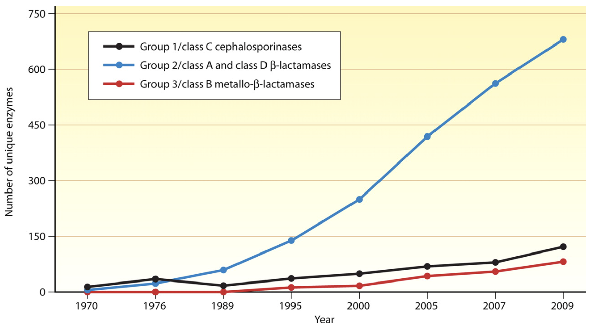{width="400"}

<figcaption>

**Figure 1. Increase in numbers of group 1, 2, and 3 beta-lactamases from 1970 to 2009**.[@BushJacoby2010]

</figcaption>

</figure>

In 2017 the WHO convened a group of experts to prioritize the need for new drugs to treat antibiotic- resistant bacteria. The WHO assigned the highest priority to antibacterial drug research and development for the Gram- negative bacteria *Acinetobacter*, *Pseudomonas* and species of *Enterobacterales* that are resistant to carbapenems and are usually extensively drug resistant (XDR).

**Table 1. WHO priority pathogens**

</figcaption>

+--------------+--------------------------------------------------------------------------------------------+
| Priority     | Pathogens included                                                                         |
+:=============+:===========================================================================================+
| **Critical** | *Acinetobacter baumannii* (Carbapenem-resistant)                                           |
|              |                                                                                            |
|              | *Pseudomonas aeruginosa* (Carbapenem-resistant)                                            |
|              |                                                                                            |
|              | Enterbacterales (3rd generation cephalosporin, carbapenem-resistant)                       |
+--------------+--------------------------------------------------------------------------------------------+
| **High**     | *Enterococcus faecium*, vancomycin-resistant                                               |
|              |                                                                                            |
|              | *Staphylococcus aureus*, methicillin-resistant, vancomycin intermediate and resistant      |
|              |                                                                                            |
|              | *Helicobacter pylori*, clarithromycin-resistant                                            |
|              |                                                                                            |
|              | *Campylobacter*, fluoroquinolone-resistant                                                 |
|              |                                                                                            |
|              | *Salmonella* spp., fluoroquinolone-resistant                                               |
|              |                                                                                            |
|              | *Neisseria gonorrhoeae*, 3rd generation cephalosporin-resistant, fluoroquinolone-resistant |
+--------------+--------------------------------------------------------------------------------------------+
| **Medium**   | *Streptococcus pneumoniae*, penicillin-non-susceptible                                     |
|              |                                                                                            |
|              | *Haemophilus influenzae*, ampicillin-resistant                                             |
|              |                                                                                            |
|              | *Shigella* spp., fluoroquinolone-resistant                                                 |
+--------------+--------------------------------------------------------------------------------------------+

</figure>

    The same year, the WHO released a [clinical pipeline report](https://apps.who.int/iris/bitstream/handle/10665/330420/9789240000193-eng.pdf), which was updated in 2018 and 2019. The report analysed antibiotics and biologics in development according to their activity against the critical priority pathogens carbapenem resistant *Acinetobacter baumannii* (CRAB), carbapenem-resistant *Pseudomonas aeruginosa* (CRPA), extended spectrum beta-lactamase (ESBL) producing Enterobacterales and carbapenem resistant Enterobacterales (CRE). The level of innovation in the global clinical pipeline was assessed on the basis or the absence of pre-existing cross-resistance to currently used antibacterial drugs. The key findings from this report were:

 

 

> -   The clinical pipeline remains insufficient to tackle the challenge of increasing emergence and spread of antimicrobial resistance.
>
> -   It is primarily driven by small- or medium-sized enterprises (SMEs), with large pharmaceutical companies continuing to exit the field.
>
> -   Eight new antibacterial agents have been approved since 1 July 2017, but overall, they have limited clinical benefits.
>
> -   One new anti-tuberculosis (anti-TB) agent, pretomanid, developed by a not-for-profit organization, has been approved for use within a set drug-combination treatment for MDR TB.
>
> -   The current clinical pipeline contains 50 antibiotics and combinations (with a new therapeutic entity) and 10 biologicals, of which 32 antibiotics are active against the WHO priority pathogens:
>
>     -   Six of these agents fulfil at least one of the innovation criteria; only two of these are active against the critical MDR Gram-negative bacteria.
>
>     -   More than 40% of the pipeline targeting WHO priority pathogens consists of additional beta-lactam and beta-lactamase inhibitor (BLI) combinations, with a major gap in activity against metallo-beta-lactamase (MBL) producers.
>
>     -   The anti-TB and *Clostridium difficile* antibacterial pipeline is more innovative than the WHO priority pathogens pipeline, with more than half of the antibiotics fulfilling all of the innovation criteria.

  The report confirms previous reports and highlights the public health implications of a drying antibiotic pipeline. In the following sections we will explore the causes and potential solutions to this crises.

## Why has antibiotic discovery faltered in recent years? {.unnumbered}

### Scientific challenges {.unnumbered}

Discovering new antibiotics is inherently challenging. Antibiotics must attack multiple target bacterial species that change over time by developing resistance, and must reach effective concentrations in multiple body compartments.[@LivermoreEtAl2011] The discoverer of a new antibiotic must guess what resistance mechanisms will be a problem in 10 years, and bring drugs to market to overcome these mechanisms. This flexibility and risk is not encountered in other therapeutic areas such as hypertension, diabetes, hyperglycemia, or Alzheimer's disease where the drugs bind to one specific target. Even for cancer chemotherapy, which develops resistance to therapy, the mechanisms leading to resistance are not transmissible to other cancers or patients. Antibiotics must also be remarkably non-toxic, as their daily dosages often measured in *grams* not *milligrams* as is the case for other pharmaceuticals.

Nearly all of the antibiotics used today belong to classes of drugs discovered before 1970. They are products of a "golden age" of antibiotic discovery from 1945-1965, which screened natural products from soil streptomyces and fungi. This discovery approach hit the law of diminishing returns by the 1960's with the same classes of antibiotics being consistently rediscovered.[@LivermoreEtAl2011] Put simply, the *low-hanging* fruit for discovering new antibiotics has already been picked. Since 1970, the only new antibiotic classes to reach the marked are the oxazolidinediones (i.e. linezolid discovered in 1978 launched in 2000) and lipopeptides (discovered in 1986 launched in 2003).

Most improvements in antibiotics since the 1970s have come through modification of existing antibiotic classes yielding analogues with increased potency and greater ability to evade existing resistance mechanisms. However, over time this approach has become more difficult with the emergence of more potent resistance mechanisms that affect multiple antibiotics within the same classe.

Given the the limits of existing strategies of screening soil organisms, the pharmaceutical industry turned to genomics-based high-throughput antibiotic discovery strategies with considerable enthusiasm in the 1990s.[@LivermoreEtAl2011] This discovery leveraged genomic sequence data from several target bacterial pathogens to identify conserved genes encoding "essential pathways" in bacteria not found in mammalian cells, and then used high-throughput inhibition screens of existing chemical compound libraries to identify "druggable" molecules for these genetic targets/pathways.

**Despite early enthusiasm and huge financial investments by many pharmaceutical companies, very few potential new antibiotic targets were identified and even fewer drugs entered into clinical development.** An example of the scientific challenge is illustrated by experience of SmithKline Beecham (later purchased by Glaxo Smith Kline-one of the few large pharmaceutical companies still involved in antibiotic discovery. Indeed, only four major pharmaceutical companies still have active antibiotic research programmes.

+------------------------------------------------------------------------------------------------------------------------------------------------------------------------------------------------------------------------------------------------------------------------------------------------------------------------------------------------------------------------------------------------------------------------------------------------------------------------------------------------------------------------------------------------------------------------------------------------------------------------------------------------------------------------------------------------------------------------------------------------------------------------------------------------------------------------------------------------------------------------------------------------------------------------------------------------------------------------------------------------------------------------------------------------------------------------------------------------------------------------------------------------+
| **The disappointment of genomics:** From 1995 to 2002, SmithKline Beecham (now part of GlaxoSmithKline (GSK) identified 300 potential targets and ran 67 high-throughput screens, each of 260,000 --530,000 compounds. Sixteen screens led to 'hits'---meaning compounds that bound selectively to a target giving a reproducible positive signal in the assays---and five of these translated into 'lead' compounds. Of the five corresponding targets, two (FabI9 and Mrs) were not universally essential or conserved, meaning that they could not be developed as broad-spectrum antibiotics, and it proved impossible to incorporate 'drug-like properties' into molecules that bound two others. The final target identified was peptide deformylase, for which GSK now has a molecule (GSK 1322322) in Phase II trials, although this did not come from high-throughput genomic-based screening. This performance appears typical of other companies that followed the genomics strategy of antibiotic discovery. Thus, 20 years after its advent, no antibiotic developed by genomic screening has reached the market.[@PayneEtAl2007] |
+------------------------------------------------------------------------------------------------------------------------------------------------------------------------------------------------------------------------------------------------------------------------------------------------------------------------------------------------------------------------------------------------------------------------------------------------------------------------------------------------------------------------------------------------------------------------------------------------------------------------------------------------------------------------------------------------------------------------------------------------------------------------------------------------------------------------------------------------------------------------------------------------------------------------------------------------------------------------------------------------------------------------------------------------------------------------------------------------------------------------------------------------+

### Antibiotic regulatory hurdles {.unnumbered}

The goal of regulatory bodies such as the U.S. Food and Drug Administration (FDA), the European Medicines Agency (EMA), and the African Medicines Agency (AMA) is to review the potential benefits and risks to ensure that new drugs that make it to market are both safe and effective for patients in need. Still, a drug that gains FDA approval may give pause to European reviewers, despite having reviewed the same evidence as their American counterparts, and vice versa. Both the [FDA](https://www.fda.gov/media/82381/download) and the [EMA](https://www.ema.europa.eu/en/documents/other/laboratory-patient-journey-centrally-authorised-medicine_en.pdf) and [AMA](https://www.ifpma.org/subtopics/african-medicines-agency/) have distinct processes with different methods of endpoint evaluation, and individual comfort levels with risk. Other countries, such as [India](https://cdsco.gov.in/opencms/opencms/en/Drugs/New-Drugs/) and [China](https://www.appliedclinicaltrialsonline.com/view/regulatory-requirements-and-key-points-drug-clinical-trials-registration-china) and many LMICs have their own processes for drug registration. **Therefore, if a new antibiotic that is effective for treating MDR pathogens is approved in one country, there is no guarantee that the drug will be favourably reviewed or available in other countries.**

Less than 10% of LMICs have access to "newly- approved" antibiotics within 10 years of approval in teh U.S. or EU, due to low expectation of revenues in these smaller markets.[@KallbergEtAl2018] This is despite the fact that the majority of the world's annual 5.7 million antibiotic-treatable deaths occur in LMICs.[@DaulaireEtAl2015] Even in HIC, patient access to new antibacterials is limited in countries such as Canada, Japan, and many European countries.[@OuttersonEtAl2021a] If truly innovative antibacterials, like those identified by WHO, cannot find profitable markets, they will not be developed in the future.

LMICs with limited drug regulatory capacity have poor control of antibiotic distribution. As a result, some antibiotics that should be reserved as a last-line treatment option are sold without a prescription. Limited regulatory capacity may also lead to rampant availability of sub-standard and falsified (counterfeit) antibiotic products, which further promote the emergence of antibiotic-resistant pathogens. *The issue surrounding counterfeit antibiotics will be discussed in more detail in Module 3.* 

<figure>

{width="600"}

<figcaption>

**Figure 2. Pathway from drug discovery to regulatory approval and estimated costs.** ADMET- studies to document drug absorption, distribution, metabolism and elimination, and toxicity in animals. PK/PD pharmacokinetic/pharmacodynamic relationships- i.e. dose response and toxicity relationships from animals.

</figcaption>

</figure>

A company seeking regulatory approval to sell a new prescription antibiotic must complete a five-step process: discovery/concept, preclinical research (animal testing), clinical research, regulatory review, and post-market safety monitoring. **The cost to achieve this regulatory approval for antibiotics has been estimated between 1 to 1.5 billion dollars**.[@WoutersEtAl2020] The two most expensive phases in antibiotic development are drug discovery (due to the high failure rate) and clinical trials. Current guidance published by the US Food and Drug Administration (FDA) and the European Medicines Agency (EMA) requires randomized controlled clinical trials to demonstrate the non-inferiority of the new antibiotic to established therapies. This has to be complemented by the enrolment of a large number of patients to support the marketing application (New Drug Application NDA or Marketing Authorization Application MAA, respectively) for 1 or more infection site--specific indication (e.g., complicated urinary tract infection or complicated intra-abdominal infection), based on the drug's clinical efficacy and safety. The bacterial pathogens relevant to the indication listed in the prescribing information are a *secondary consideration* based on the spectrum of activity of the investigational antibiotic and the microbiological data from patients collected during clinical trials.[@EcholsEtAl2019a] **As a result, even if a new antibiotic is developed for a MDR pathogen, it is not possible to perform clinical studies and receive approval from the FDA or EMA for an indication of treating MDR pathogens.**

Despite these high risks and costs, the returns to the innovator and investor for approved antibiotics are relatively poor. Profitability is often not realized before the 20-year exclusive patent expires.[@McKenna2020] Industry analysts estimate that the average revenue generated from an antibiotic's sale is roughly \$46 million per year.[@WoutersEtAl2020] **The fundamental problem for antibiotics is that their development is not profitable** compared to other therapeutic areas.  

<figure>

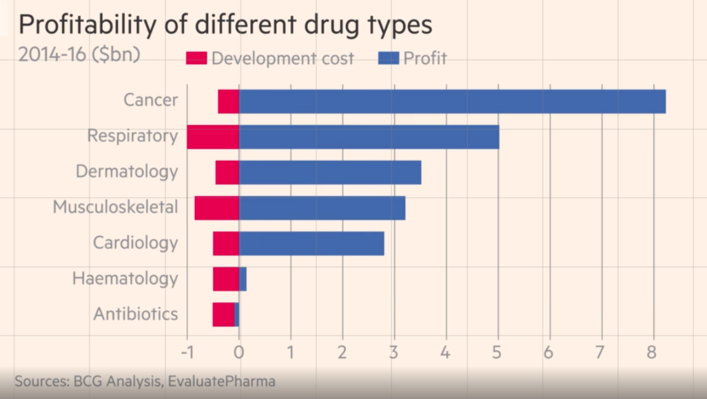{width="600"}

<figcaption>

**Figure 3. Profitability of the antibiotic sector vs. other drug types.** Source: Financial Times

</figcaption>

 

Moreover, it is difficult for an antibiotic manufacturer to be able to precisely identify the small proportion of patients who both really need the antibiotic for a MDR pathogen and are willing to pay a high price for the drug. As noted by Ardal and colleagues:[@ArdalEtAl2020a]

> The major challenge with antibiotics is profitability. As older antibiotics are still effective for treating most infections, the primary value of new antibiotics is to treat multidrug-resistant (MDR) infections and provide a protective benefit against emerging pathogens. The duration of antibiotic treatment for individual patients is relatively short (for example, 1--2 weeks or up to 1 month), whereas the treatment for chronic conditions such as hypertension or hyperlipidemia can be continuous over many years. Resistance is hastened by use, new antibiotics are stewarded as a last resort, which results in low unit sales. Whereas medicines for rare diseases have used high unit-pricing strategies to achieve profitability, these are often unavailable to antibiotic developers due to clinical trial design (it is difficult to demonstrate the superiority of new antibiotics as resistance is still relatively uncommon) and bundled hospital reimbursement structures (whereby hospitals are incentivized to prescribe lower-cost antibiotics). Large pharmaceutical companies have largely abandoned the market, accounting for only 4 of the 42 antibiotics currently under development.[@Mullard2019] Any investment in a new antibiotic is seen as a high-risk proposition, and consequently the returns expected by prospective investors are high to account for this risk premium. This in turn puts pressure on small and medium-sized enterprises (SMEs), as there is little chance that their candidate -antibiotics will be purchased by larger companies.

  Enormous costs are also incurred once an antibiotic is approved as regulatory agencies make registration and marketing contingent on post-approval obligatory (phase IV) studies: pediatric dosing and safety studies, pharmacokinetic studies in special populations (i.e. elderly, obese, dialysis), pharmacovigalence (safety), development and validation of susceptibility testing technology, manufacturing and supply chain investments, and a 5-10 years commitment to monitor resistance through antimicrobial surveillance studies. Recouping these costs may be impossible for drugs with activity against MDR pathogens as many many countries and health systems will negotiate the lowest possible price for purchase and then (appropriately) restrict the use of the antibiotic to preserve its effectiveness- resulting in low sales. This is completely different from a scenario of a new "breakthrough" cancer therapy, where the drug will be immediately incorporated in treatment algorithms for eligible patients.

Fundamentally, the math problem of antibiotic profitability can be summarized as:

$Costs= Antibiotic \ Price * Units\ Sold$

 

The only way to recover the investment in antibiotics is to either charge very high prices for the antibiotic or to sell/use lots of antibiotic, thus driving resistance. Both options are difficult to justify to patients.

 

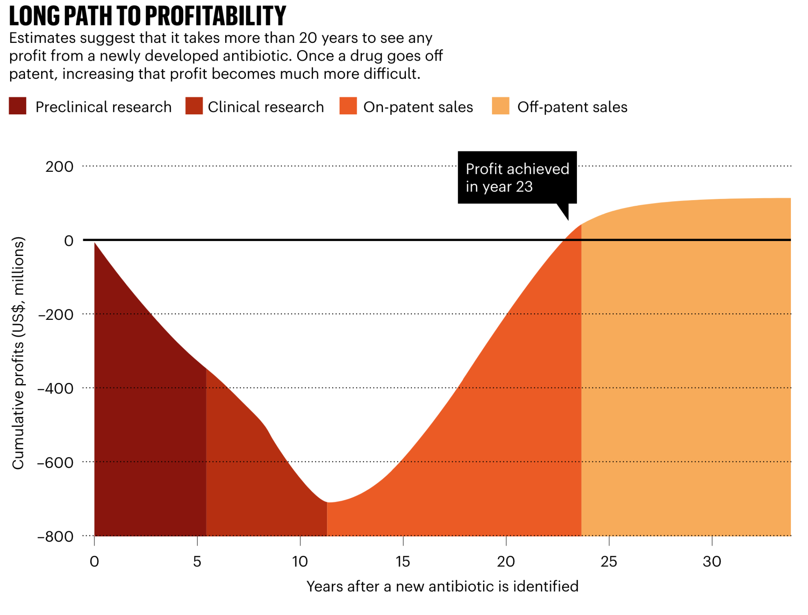{width="600"}

<figcaption>

**Figure 4. Delayed profitability post antibiotic approval.** Source McKenna et al.[@McKenna2020]

</figcaption>

 

While the high post-approval costs may be absorbable by large pharmaceutical companies with other profitable drug products in other therapeutic areas, they can put smaller companies out of business. The company must pay for the high post-approval costs described above that for antibiotics cannot be covered through aggressive sales. For antibiotics, companies have no way to pay for them without positive net revenues in an environment that hinders their ability to raise additional funds. especially if the approved drug was developed for MDR pathogens as illustrated by the experience of the small antibiotic company Achaogen.

+-----------------------------------------------------------------------------------------------------------------------------------------------------------------------------------------------------------------------------------------------------------------------------------------------------------------------------------------------------------------------------------------------------------------------------------------------------------------------------------------------------------------------------------------------------------------------------------------------------------------------------------------------------------------------------------------------------------------------------------------------------------------------------------------------------------------------------------------------------------------------------------------------------------------------------------------------------------------------------------------------------------------------------------------------------------------------------------------------------------------------------------------------------------------------------------------------------------------------------------------------------------------------------------------------------------------------------------------------------------------------------------------------------------------------------------------------------------------------------------------------------------------------------------------------------------------------------------------------------------------------------------------------------+
| **For further study:** Achaogen is small pharmaceutical company that developed plazomicin (Zemdri), a broad-spectrum aminoglycoside antibacterial in 2009 with activity against carbapenem-resistant Enterbacterales (CRE). Despite initial plans to develop the drug as a much-needed new treatment for CRE --- which included drug-resistant *Klebsiella* species and *Escherichia co*li --- a phase III trial that started in 2014 in this setting struggled to recruit patients. The company pivoted to initiate a phase III trial in complicated urinary tract infections (cUTIs) in 2016, and submitted the drug for FDA approval in this indication and in bloodstream infections in 2017. Although plazomicin was approved for cUTIs in 2018, the FDA rejected its use in the potentially more lucrative and important bloodstream infections indication despite evidence of improved outcomes in patients with carbapenem-resistant infections. An independent advisory committee also voted against approval in the bloodstream, noting that the efficacy signal came from a small study of just 28 patients. In the end, Achaogen spent 15 years and a billion dollars to win FDA approval for Zemdri, a drug for hard-to-treat UTIs. In July, the World Health Organization added plazomicin to its [list of essential new medicines](https://www.who.int/medicines/publications/essentialmedicines/en/). Less than a year later, Achaogen filed for bankruptcy. See: [Crises Looms in Antibiotics as Drug Makers Go Bankrupt, NY Times, December 25, 2019](https://www.nytimes.com/2019/12/25/health/antibiotics-new-resistance.html). |
+-----------------------------------------------------------------------------------------------------------------------------------------------------------------------------------------------------------------------------------------------------------------------------------------------------------------------------------------------------------------------------------------------------------------------------------------------------------------------------------------------------------------------------------------------------------------------------------------------------------------------------------------------------------------------------------------------------------------------------------------------------------------------------------------------------------------------------------------------------------------------------------------------------------------------------------------------------------------------------------------------------------------------------------------------------------------------------------------------------------------------------------------------------------------------------------------------------------------------------------------------------------------------------------------------------------------------------------------------------------------------------------------------------------------------------------------------------------------------------------------------------------------------------------------------------------------------------------------------------------------------------------------------------+

 

## What are the current strategies to incentive antibiotic development? {.unnumbered}

**Economic incentives for antibiotics are categorized as either 'push' or 'pull'. Push incentives occur before regulatory approval by the FDA or EMA, and the funding supports many projects, including the many that fail before approval. Pull incentives are paid only after regulatory approval and hence only successful products are supported. Both push and pull incentives are required to address the lack of antibiotic development.**

Many successful initiatives to establish push funding for antibiotics have been developed over the last decade. At present, major AMR push development initiatives include:

-   [US Biomedical Advanced Research and Development Authority, BARDA](https://www.phe.gov/about/barda/Pages/default.aspx) (1.2 billion dollars to support Phase 2/3 antibiotic development against 21st century threats including drug-resistant bacteria, supports CARB-X)

-   [CARB-X](https://carb-x.org/) (550 million, Hits to lead Phase 1 product development of therapeutics, diagnostics and preventatives against WHO and CDC priority drug-resistant bacteria)

-   [The Global Antibiotic Research and Development Partnership, GARDP](https://www.gardp.org/) (Produce discovery from discovery to delivery including novel therapeutics, optimizing antibiotics, developing combinations. Focused on WHO priority list).

-   [The European Gram Negative AntiBacterial Engine, ENABLE](https://www.imi.europa.eu/projects-results/project-factsheets/enable)

-   [Novo Holdings REPAIR Impact Fund](https://www.repair-impact-fund.com/) (165 million investment in lead optimization to Phase I development of therapeutics and diagnostics against WHO priority drug-resistant bacteria.)

-   [Joint Programming Initiative on Antimicrobial Resistance, JPIAMR](https://www.jpiamr.eu) (novel therapeutics, diagnostics, surveillance, prevention, stewardship, WHO priority pathogens

-   [Wellcome Trust](https://wellcome.org/) (175 million drug-resistant infections focused on policy, strengthening evidence for action, clinical trial capabilities and innovative product development including CARB-X

-   [Innovative Medicines Initiative](https://www.imi.europa.eu/)

-   [AMR Action Fund](https://www.amractionfund.com/) Joint program through WHO, European Investment Bank, and Wellcome Trust

-   [UK AID](https://www.gov.uk/government/groups/the-global-amr-innovation-fund) (315 million pounds funded through the Global AMR innovation fund and the Fleming Fund to help LMICs tackle AMR).

-   The [German Federal Ministry of Education and Research](https://www.gesundheitsforschung-bmbf.de/en/GlobalAMRHub.php) support of national research programs as well as contributions to international initiatives like CARB-X, GARDP, and JPIAMR.

-   [Bill & Melinda Gates Foundation](https://www.gatesfoundation.org/) (124 million targeting drug-resistant infections in low-middle income countries (LMICs), disease surveillance, vaccine development, economic modeling, and CARB-X

-   [U.S. National Institutes of Health](https://www.niaid.nih.gov/research/antimicrobial-resistance) (1.4 billion dollars funding basic research, academic industry startup partnerships, and other research and development against bacterial threats, for vaccines, therapeutics and diagnostics

These push incentives have led to some progress in antibiotic development. The preclinical pipeline is shifting to higher quality products targeting the most urgent clinical needs, reducing the economic risk for antibiotic discovery. Without these programmes, the fragile pipeline would have likely become entirely moribund. **Yet the bankruptcy of Achaogen in April 2019 and subsequent other companies working in the antibiotic sector provided a wake-up call for the antibiotics industry: The finish line is not FDA or EMA approval, but break-even profitability.** For Achaogen, scientific and regulatory achievement ended in economic disaster. A similar fate awaits other antibiotic companies unless governments enact meaningful pull incentives in the next year.

<figure>

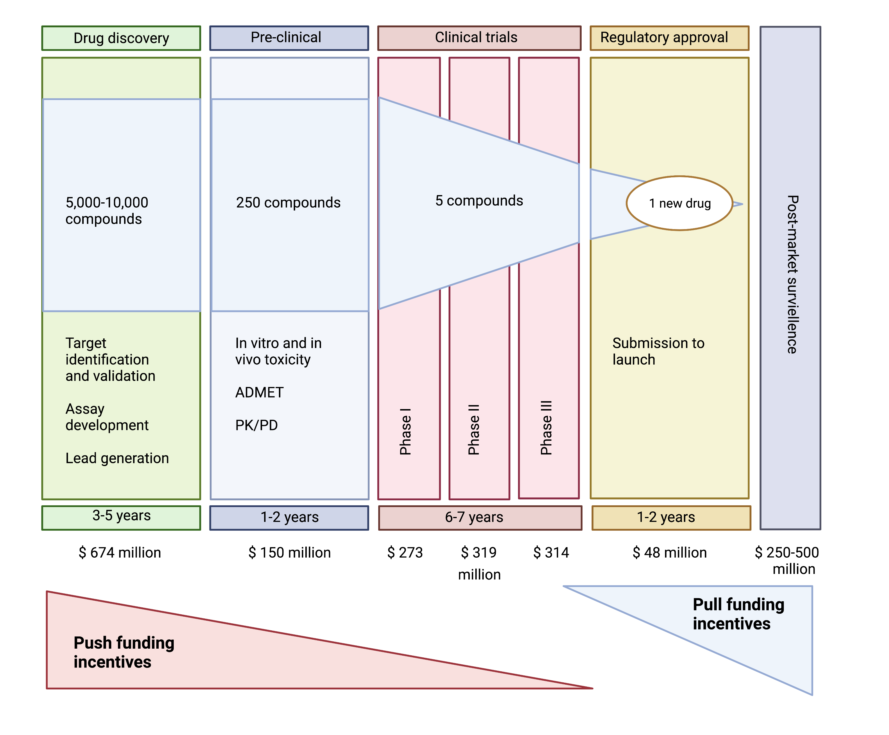{width="600"}

<figcaption>

**Figure 5. Push versus pull incentives for antibiotic development.**

</figcaption>

</figure>

Pull incentives are increasingly becoming the focus of of new initiatives to develop antibiotics in the United States and Europe. Clearly, effective pull funding will require substantial public investment that may not be politically popular if viewed as a large cash "handout" to pharmaceutical companies. Some novel reimbursement schemes with pull incentives for antibiotic development are starting (recently reviewed by Gotham et al.[@GothamEtAl2021] **One of the most frequently discussed pull incentives is the "Netflix reimbursement model" that is currently being implemented pilot projects in the [UK](https://www.gov.uk/government/news/world-first-scheme-underway-to-tackle-amr-and-protect-uk-patients) and [Sweden](https://www.folkhalsomyndigheten.se/the-public-health-agency-of-sweden/communicable-disease-control/antibiotics-and-antimicrobial-resistance/availability-of-antibiotics/). This payment mechanism is based on a 'de-linkage' reimbursement approach** because it separates the payments to innovators/ manufacturers from the number of antibiotic units sold.

<figure>

{width="400"}

<figcaption>

**Figure 6. Financial Times Video Examining the "Netflix Model" of Pull Incentives for Antibiotic Reimbursement.**

</figcaption>

</figure>

**How can the true value of antibiotics be better communicated to the public?** Two leading experts in the economics of antibiotic development (Drs. John Rex and Ken Outterson) have suggested that antibiotics should be thought of more like the "fire-extinguishers" of medicine.

> No one wakes up hoping they get to use a fire extinguisher that day. Not even the fire department. Fire fighters go to work every day and hope they don't get any calls. They perform regular maintenance on all their gear and stay at the station 24/7 just as a precaution. We pay them to be available and prepared so they can come to our rescue when we need them. If we didn't pay for the fire department for years and then a fire broke out in the middle of your town, can you imagine the damage? People would die unnecessarily, the medical system would be overwhelmed, and the fire could spread beyond the borders of the town. The fire might rage through the whole county, then the region, and then your entire country. It might even spread through the entire world, just like COVID-19.     A fire fighter uses a hose to subdue flames engulfing a home while a physician uses antibiotics to stop an infection in your body. We need to be prepared for fires -- the flame kind and the medical kind. As a society, we are prepared for the flame kind. But the medical? We aren't even close.   Without antibiotics, all of modern medicine will change worldwide. Diseases we think of only being in the history books could become a part of every day life again. Minor surgery could become life threatening. An infected cut on your hand could be the end. Childbirth will easily endanger the lives of mothers and newborns. Cancer treatments will be nearly impossible. Antibiotics are vitally important to all of humanity.     -[John Rex, M.D., AMR Solutions](https://amr.solutions/fire-extinguishers-of-medicine/)

 For more information on how AMR risks can be responsibly and effectively communicated to the public, view this excellent video prepared by the Wellcome Trust on YouTube: [Drug resistant infections: the power of language.](https://www.youtube.com/watch?v=wTgRpOIxNG0&t=6s)  

+-----------------------------------------------------------------------------------------------------------------------------------------------------------------------------------------------------------------------------------------------------------------------------------------------------------------------------------------------------------------------------------------------------------------------------------------------------------------------------------------------------------------------------------------------------------------------------------------+
| **For further study:** Tetraphase pharmaceuticals is a small company with an innovative and unique chemistry platform for novel tetracycline analogues that have activity against several organisms on the WHO Priority Pathogens List. Their lead compound, eravacycline, was approved by the FDA for the treatment of complicated intraabdominal infections in 2018. Like many of its peers, merely securing approval was only the first hurdle. What has happened since to eravacycline and Tetraphase pharmaceuticals? How could a different reimbursement scheme changed outcomes? |
+-----------------------------------------------------------------------------------------------------------------------------------------------------------------------------------------------------------------------------------------------------------------------------------------------------------------------------------------------------------------------------------------------------------------------------------------------------------------------------------------------------------------------------------------------------------------------------------------+

### Antibiotic supply chain problems {.unnumbered}

Although much of the focus on antibiotic availability is focused on new drugs for AMR, another worrying phenomenon is the increasing shortages of older generics, mostly injectable antibacterials, such as piperacillin-tazobactam or benzylpenicillin. Drug shortages are another factor that can contribute to AMR, as drugs ideally reserved for critically-ill patients or MDR infections may need to be substituted when supply problems for first-line antibiotic arise.[@ShafiqEtAl2021] The fierce price competition combined with stringent production requirements for parenteral antibacterials has led to a significant reduction of suppliers, in particular of active pharmaceutical ingredients, and to highly optimized and thus more vulnerable supply chains. Increasingly prevalent shortages of even older antibiotics is now recognized as a major public health threat and requires additional specific action.

<figure>

 

 

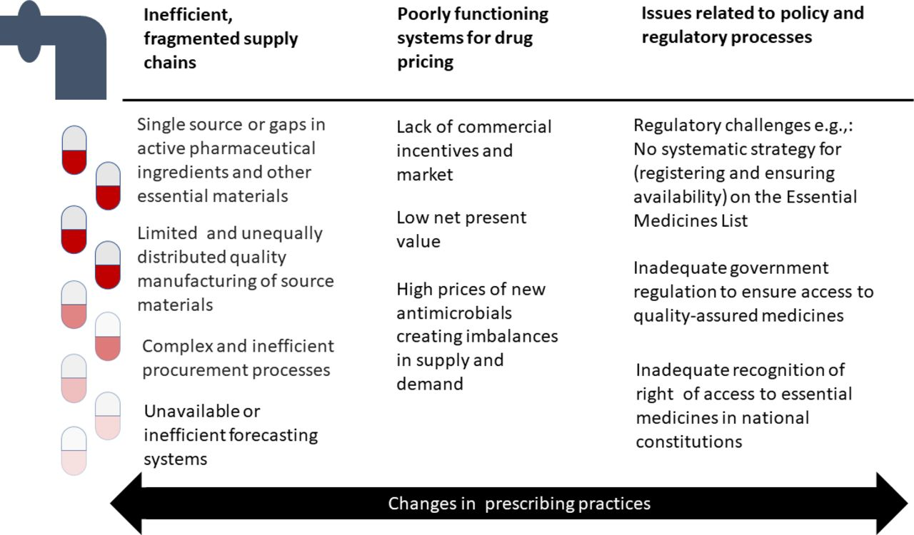{width="600"}

<figcaption>

**Figure 7**. The reasons for antimicrobial shortages across the development, distribution and use pathway.

</figcaption>

</figure>

## What can be done to ensure antibiotic access in LMICs? {.unnumbered}

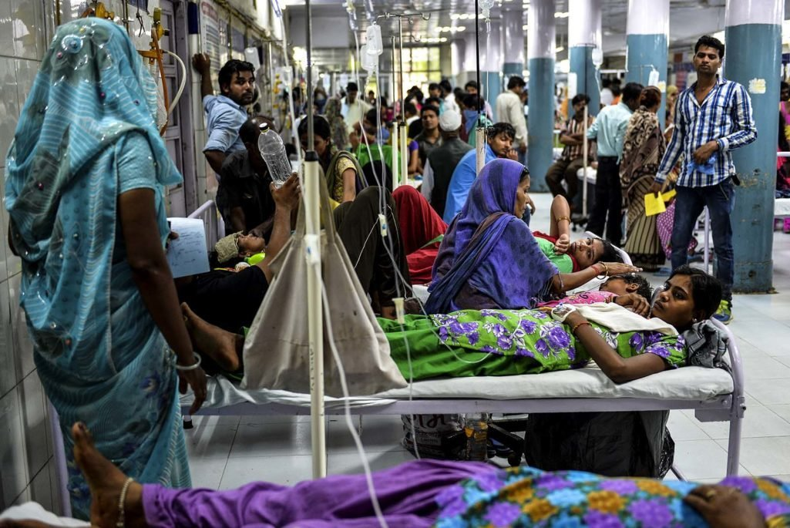{width="600"}

<figcaption>

Image: World Health Organization

Individuals living in poverty are often susceptible to infections and lack of access to basic sanitation facilities or adequate health care. Antibiotics, which may be available without prescription, are often used as substitutes for clean food, clean water, vaccines and diagnostics. Therefore, it will be impossible to address the challenges of antimicrobial resistance and lack of access to antibiotic therapy if other contributing social factors are not addressed.

**For countries where antibiotics can be accessed without a prescription, controlling antibiotic distribution should be highly prioritized.** However, introduction of a new prescription system when antibiotic demand is still high can lead to unintentional consequences (such as the distribution of antibiotics on the black market) that are even harder to control. It is important to note that the overuse of antibiotics has become a social norm in many countries as it is influenced by the beliefs and attitudes of the individuals towards antibiotics as well as sociocultural factors, regardless of medical justifications. [@DoEtAl2021]

Antibiotic use is generally higher in the developed world, but LMICs are rapidly catching up as access to healthcare improves and the burden of antibiotic-treatable infections remains high. Between 2000 and 2015, the global rate of antibiotic consumption increased by 39%, from 11.3 to 15.7 defined daily doses (DDDs) per 1,000 inhabitants per day. In LMICs, the consumption rate for cephalosporins, quinolones, and macrolides has increased by 399%, 125%, and 119%, respectively, while in high-income countries (HICs), consumption has decreased by 18%, 1%, and 25%, respectively.

+-----------------------------------------------------------------------------------------------------------------------------------------------------------------------------------------------------------------------------------------------------------------------------------------------------------------------------------------------------------------------------------------------------------------------------------------------------------------------------------------+
| Defined daily dose (DDD) is an index of drug consumption, defined by the World Health Organization, used to facilitate the comparison of drug usage between different drugs or between different health care environments. DDD is calculated by multiplying the quantity in milligrams of the antibiotic by a DDD conversion factor. For example, the strength of one ciprofloxacin tablet is 500 mg and the DDD is 1 g for ciprofloxacin. Each 500 mg tablet is equivalent to 0.5 DDD. |
+-----------------------------------------------------------------------------------------------------------------------------------------------------------------------------------------------------------------------------------------------------------------------------------------------------------------------------------------------------------------------------------------------------------------------------------------------------------------------------------------+

  In an analysis by the Center for Disease Dynamics, Economics & Policy (CDDEP),three key barriers in LMICs were identified that affect access to newer antibiotics for resistant pathogens:[@FrostIsabelEtAl2019]

### Barrier 1: Weak drug discovery, difficulties in market entry, and poor stewardship lead to irrational selection and use of antibiotics {.unnumbered}

Incentives for the sale of antibiotics promote inappropriate use, and conflicts of interest arise when the sale of medicines is not separated from the remuneration of hospitals and prescribers. For example, in China, hospitals derive significant revenues from the sale of antibiotics, and consequently, antibiotics are prescribed widely and inappropriately. A hospital may receive a higher payment for treating an infection with a carbapenem versus and aminopenicllin, irrespective of the susceptibility of the pathogen. Marketers with unrestricted access to healthcare providers in LMICs can influence prescribing. In Uganda, doctors can receive financial incentives for prescribing specific brands or using a specific pharmacy. Many doctors have a financial interest in private pharmacies and prescribe more expensive antibiotics even when unnecessary. Promoters from pharmaceutical companies encourage doctors to prescribe multiple medications simultaneously and have unregulated access to doctors and pharmacists.

In India, direct and indirect gifts from medical representatives and commissions influence prescribing practices, and hospitals profit from sales. Doctors feel perceived or real pressure from patients, who, if unsatisfied, may change doctors. Doctors may prescribe for shorter durations than the recommended course of treatment to ensure that the patient returns. Prescribers may prefer to prescribe injectable formulations to maximize their profits

Self-prescribing of antibiotics is common across LMICs. In Uganda, 41% of antibiotic sales are over-the-counter. Antibiotics are easily obtained without prescription, and patients may reuse old prescriptions to treat recurrent infections or avoid going to a doctor for infections they consider embarrassing. Moreover, non-professionals often prescribe or dispense antibiotics. Healthcare providers without formal training provide more than 70% of primary care in India. Only 58% of those referring to themselves as doctors in India's cities have a medical degree; in rural areas the proportion is just 19%, and a third of 'doctors' have only a secondary school education.    

**CDDEP Recommendations for Improving Antibiotic Access in LMICs**

+-----------+-------------------------------------------------------------------------------------------------------------------------------------+----------------------------------------------------------------------------------------------------------------------------------------------------------------+-------------------------------------------------------------------------------------------------------------------------------------------------------------------------------------------------------------------------------------------------------------------------------------------------------------------------------------------------------------+
|           | **Recommend.**                                                                                                                      | **Stakeholders**                                                                                                                                               | **Rationale**                                                                                                                                                                                                                                                                                                                                               |
+===========+=====================================================================================================================================+================================================================================================================================================================+=============================================================================================================================================================================================================================================================================================================================================================+
| **1**     | Encourage R&D of new or improved antibiotics, diagnostic tests, vaccines, and alternatives to antibiotics for bacterial infections. | Countries, regional collaborations, WHO and other international bodies, pharmaceutical industry, academia                                                      | At a global scale, higher investment in novel antibiotics, temperature-stable formulations, and rapid diagnostic tests is needed.                                                                                                                                                                                                                           |
+-----------+-------------------------------------------------------------------------------------------------------------------------------------+----------------------------------------------------------------------------------------------------------------------------------------------------------------+-------------------------------------------------------------------------------------------------------------------------------------------------------------------------------------------------------------------------------------------------------------------------------------------------------------------------------------------------------------+
| **2**     | Support the registration of antibiotics in more countries according to clinical need.                                               | WHO and other international bodies, national governments, policymakers, regulators, pharmaceutical industry                                                    | Efforts at the national, regional, and global levels to support drug registration could reduce the upfront cost of accessing less attractive markets and benefit patients by making life-saving drugs available.                                                                                                                                            |
|           |                                                                                                                                     |                                                                                                                                                                |                                                                                                                                                                                                                                                                                                                                                             |
|           |                                                                                                                                     |                                                                                                                                                                | Newer drugs coming to market are likely to be introduced by small and medium-size enterprises that may not have the expertise or resources to register in multiple countries. However, this cost should not be a barrier.                                                                                                                                   |
+-----------+-------------------------------------------------------------------------------------------------------------------------------------+----------------------------------------------------------------------------------------------------------------------------------------------------------------+-------------------------------------------------------------------------------------------------------------------------------------------------------------------------------------------------------------------------------------------------------------------------------------------------------------------------------------------------------------+
|           |                                                                                                                                     | Regulators and policymakers                                                                                                                                    | In many instances, regulations and requirements could be aligned across countries and simplified to reduce costs                                                                                                                                                                                                                                            |
+-----------+-------------------------------------------------------------------------------------------------------------------------------------+----------------------------------------------------------------------------------------------------------------------------------------------------------------+-------------------------------------------------------------------------------------------------------------------------------------------------------------------------------------------------------------------------------------------------------------------------------------------------------------------------------------------------------------+
|           |                                                                                                                                     | Pharmaceutical companies                                                                                                                                       | Plans for registration should be part of the development process.                                                                                                                                                                                                                                                                                           |
+-----------+-------------------------------------------------------------------------------------------------------------------------------------+----------------------------------------------------------------------------------------------------------------------------------------------------------------+-------------------------------------------------------------------------------------------------------------------------------------------------------------------------------------------------------------------------------------------------------------------------------------------------------------------------------------------------------------+
| **3**     | Establish standards of practice and national treatment guidelines.                                                                  | WHO, countries, experts and their professional associations, hospitals and community care facilities                                                           | The WHO should issue a call to\                                                                                                                                                                                                                                                                                                                             |
|           |                                                                                                                                     |                                                                                                                                                                | action for all professional associations and councils involved in prescribing practices to develop clinical guidelines for treating infectious diseases at all levels of healthcare.                                                                                                                                                                        |
+-----------+-------------------------------------------------------------------------------------------------------------------------------------+----------------------------------------------------------------------------------------------------------------------------------------------------------------+-------------------------------------------------------------------------------------------------------------------------------------------------------------------------------------------------------------------------------------------------------------------------------------------------------------------------------------------------------------+
| **4**     | Generate awareness and educate patients and prescribers.                                                                            | NGOs, advocacy groups, professional bodies, WHO offices at all levels, health ministries, and local institutions (hospitals, clinics, schools, churches, etc.) | Information about the price and quality of antibiotics approved for use in a country will support rational prescribing and use, as will surveillance data on local antibiotic resistance profiles.                                                                                                                                                          |
|           |                                                                                                                                     |                                                                                                                                                                |                                                                                                                                                                                                                                                                                                                                                             |
|           |                                                                                                                                     |                                                                                                                                                                | NGOs, professional bodies, and\                                                                                                                                                                                                                                                                                                                             |
|           |                                                                                                                                     |                                                                                                                                                                | advocacy groups can use existing communications channels to educate patients and prescribers about drug quality and rational antibiotic use. Such information will empower consumers who purchase drugs out-of-pocket to demand quality antibiotics while increasing price competition among suppliers and removing poor-quality suppliers from the market. |
+-----------+-------------------------------------------------------------------------------------------------------------------------------------+----------------------------------------------------------------------------------------------------------------------------------------------------------------+-------------------------------------------------------------------------------------------------------------------------------------------------------------------------------------------------------------------------------------------------------------------------------------------------------------------------------------------------------------+
| **5**     | Reduce conflict of interest and incentives that lead to inappropriate antibiotic use.                                               | Regulators, NGOs, doctors, and patients                                                                                                                        | Conflicts of interest between prescribers and the vendors of pharmaceuticals can be addressed by regulating gifts from drug companies and promoting the enforced or voluntary declaration of such gifts                                                                                                                                                     |
+-----------+-------------------------------------------------------------------------------------------------------------------------------------+----------------------------------------------------------------------------------------------------------------------------------------------------------------+-------------------------------------------------------------------------------------------------------------------------------------------------------------------------------------------------------------------------------------------------------------------------------------------------------------------------------------------------------------+

### Barrier 2: Antibiotics are not affordable for many in LMICs and government funding for health is low {.unnumbered}

LMICs face constraints on public spending and have insufficient budgets for healthcare. In Uganda, interviewees indicated that just 8.9% of the national budget goes to health services and only 47% of essential medicine list drugs, including antibiotics, are purchased.[@FrostIsabelEtAl2019] Government spending on healthcare in India is 1.4% of gross domestic product and insurance coverage is poor. Public health facilities lack adequate medicine stocks, and antibiotic availability is 50% to 60% in some states

Although global supply shortages have affected even HICs, the immediate challenges in LMICs are often associated with supply chain management and budgets for medicines. When stockouts are used as an metric for analyzing the performance healthcare system, countries may have incentives to keep drugs in stock but not distribute them.   

**CDDEP Recommendations**

+------------+------------------------------------------------------+-----------------------------------------------------------------+---------------------------------------------------------------------------------------------------------------------------------------+
|            | **Recommend.**                                       | **Stakeholders**                                                | **Rationale**                                                                                                                         |
+============+======================================================+=================================================================+=======================================================================================================================================+
| **6**      | Explore innovative funding of essential antibiotics. | UNICEF, WHO, national governments, pharmaceutical manufacturers | Countries with less purchasing\                                                                                                       |
|            |                                                      |                                                                 | power could pool their resources for procurement under arrangements similar to Gavi (the vaccine alliance)\                           |
|            |                                                      |                                                                 | or the Global Fund. UNICEF/WHO might coordinate procurement and distribution. Besides helping LMICs increase their purchasing power,\ |
|            |                                                      |                                                                 | such an arrangement would support quality manufacturers while driving out substandard suppliers.                                      |
+------------+------------------------------------------------------+-----------------------------------------------------------------+---------------------------------------------------------------------------------------------------------------------------------------+

### Barrier 3: Weak health systems, unreliable supply chains and poor quality control fail to deliver antibiotics to patients in need {.unnumbered}

For many patients in LMICs, out-of-pocket payments for antibiotics either limit access or push people into poverty. In remote areas, transportation costs for patients and accompanying relatives can be substantial, in some cases exceeding 20% of medical costs. In rural Kenya, the main reason for not seeking treatment was "lack of cash." "No drugs available" and "drugs are ineffective" were also stated as reasons.   

**CDDEP Recommendations**

+----------+--------------------------------------------------------------------------------------+---------------------------------------------------------------------------------------------------+----------------------------------------------------------------------------------------------------------------------------------------------------------------------------------------------------------------------------------------------------------------------------------------------------------------------+
|          | **Recommend.**                                                                       | **Stakeholders**                                                                                  | **Rationale**                                                                                                                                                                                                                                                                                                        |
+==========+======================================================================================+===================================================================================================+======================================================================================================================================================================================================================================================================================================================+
| 7        | Ensure the quality of antibiotics, and strengthen pharmaceutical regulatory capacity | WHO, national and regional regulators, countries, pharmaceutical suppliers and manufacturers      | WHO support and coordination, national and regional regulators could collaborate to support quality assurance and avoid duplication of effort across countries.                                                                                                                                                      |
|          |                                                                                      |                                                                                                   |                                                                                                                                                                                                                                                                                                                      |
|          |                                                                                      |                                                                                                   | Rapid information exchange for pharmacovigilence, information on poor- quality suppliers, and sharing of best practices and innovation will help drive substandard and falsified antibiotics from the market.                                                                                                        |
|          |                                                                                      |                                                                                                   |                                                                                                                                                                                                                                                                                                                      |
|          |                                                                                      |                                                                                                   | An international entity, such as the WHO, could provide surveillance, monitoring, and compliance testing for antibiotic quality. Such work\                                                                                                                                                                          |
|          |                                                                                      |                                                                                                   | would support LMICs' regulatory authorities and also ensure the integrity of the supply chain from the dominant suppliers in India and China. It could also establish standards for generic antibiotics and fixed-dose combinations, which are commonly used in LMICs, and support the industry in self- regulation. |
+----------+--------------------------------------------------------------------------------------+---------------------------------------------------------------------------------------------------+----------------------------------------------------------------------------------------------------------------------------------------------------------------------------------------------------------------------------------------------------------------------------------------------------------------------+
| 8        | Encourage local manufacturing for cost-effective antibiotics.                        | Countries, regional collaborations, pharmaceutical industry, including drug R&D and manufacturers | Development and diversification of local manufacturers can help ensure the steady supply of essential, quality-assured antibiotics so that countries can meet their own needs. This should be supported through regional collaborations of countries such as the African Union.                                      |
+----------+--------------------------------------------------------------------------------------+---------------------------------------------------------------------------------------------------+----------------------------------------------------------------------------------------------------------------------------------------------------------------------------------------------------------------------------------------------------------------------------------------------------------------------+

## Summary {.unnumbered}

Ultimately, there are many interrelated scientific and economic challenges contributing to lack of development of new antimicrobials. Several factors can be addressed to improve the scientific and economic environment for restoring health to the antibiotic pipeline and access. Antibiotic stewardship and infection prevention must therefore be pursued alongside improvements in access to antibiotics in LMICs. All stakeholders, international bodies, government leaders, health and agriculture ministries, patients and medical practitioners, farmers and veterinarians, academia, and the pharmaceutical industry--- must slow the emergence of resistance to existing antibiotics to ensure affordability and access everywhere.

 

# Module 3: Antibiotic and diagnostic test availability, affordability in LMICs: Lessons from the COVID-19 pandemic {.unnumbered}

<figure>

{width="600"}

<figcaption>

Image: World Health Organization

</figcaption>

</figure>

## COVID-19 Vaccine Access in Low-Middle Income Countries (LMICs) {.unnumbered}

In Module 2 we examined the crises in antibiotic development including its impact on low-middle income countries (LMICs). We also highlighted special challenges related to antibiotic access in countries where healthcare resources are limited. In this module we will further explore the challenges of improving antibiotic or vaccine availability and access to diagnostic testing through recent experiences with the COVID-19 pandemic.

As of December 30, 2021, the [WHO Coronavirus (COVID-19) Dashboard](https://covid19.who.int/) reports over 285 million cumulative cases and 5.4 million deaths due to SARS-CoV-2. Over 1.3 million new cases are reported daily.

<figure>

<figcaption>

**Figure 1. WHO COVID-19 Dashboard:** <https://covid19.who.int/>

</figcaption>

</figure>

For Africa-specific data, see: <https://africacdc.org/covid-19/>

Beyond direct illness and death, the COVID-19 has had numerous repercussions on mental health, education, and breakdowns in the global supply chain for many healthcare and consumer goods. Although some issues were predictable, others were impossible to foresee in the area of global health, for example:

-   TB deaths also climbed worldwide for the first time in a decade, according to [a October 14 WHO report](https://www.who.int/news/item/14-10-2021-tuberculosis-deaths-rise-for-the-first-time-in-more-than-a-decade-due-to-the-covid-19-pandemic) that directly tied the increase to the pandemic.
-   Measles outbreaks [may be more likely](https://www.cdc.gov/mmwr/volumes/70/wr/mm7045a1.htm?s_cid=mm7045a1_w) in the near future, after the number of infants missing their first vaccination jumped by 3 million last year---the largest increase in 20 years.
-   Malaria's 241 million cases and 627,000 deaths in 2020 reflect increases of 14 million and 69,000 respectively---both were largely attributed to pandemic disruptions, according to [WHO's global malaria report](https://www.who.int/teams/global-malaria-programme/reports/world-malaria-report-2021#:~:text=According%20to%20WHO's%20latest%20World,and%2069%20000%20more%20deaths) released on December 6.

According to the WHO, over 11 billion people must be vaccinated against COVID-19. As of December, 57.4% of the world population has received at least one dose of a COVID-19 vaccine. Over 8.99 billion doses have been administered globally, and 33.05 million are now administered each day. **Ten countries account for 77% of the globally administered doses.** Unfortunately, the vaccine market has been cornered by rich nations. The EU, the UK, and the USA have all purchased far more vaccine than they can possibly use. **Only 8.3% of people in LMICs have received at least one dose of COVID-19.**

<figure>

{width="600"}

<figcaption>

**Figure 2. COVID-19 vaccination doses administered per 100 people within a given population**. Data source: Our World in Data

</figcaption>

</figure>

  The data illustrated in the map below shows that the African continent has been largely left behind in terms of COVID-19 vaccination. This lack of vaccine coverage has likely contributed to the emergence of the highly-contagious Omicron variant on the African continent. However, access to testing and sequencing of strains is also limited in in many regions of Africa, the full epidemiological picture of COVID-19 on the African continent is unclear.

<figure>

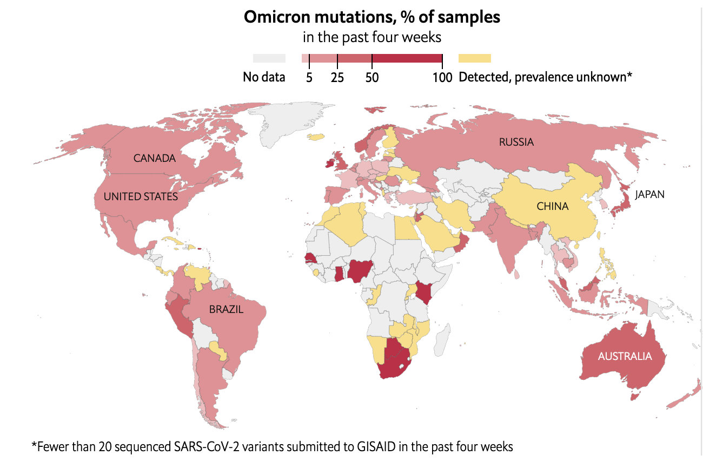{width="600"}

<figcaption>

**Figure 2. Percent of COVID-19 representing the Omicron Variant as of December 26, 2021**. Data source: The Economist

</figcaption>

</figure>

### COVID-19 Vaccines Global Access (COVAX) Program {.unnumbered}

The COVAX program is a program for purchasing and distributing COVID-19 vaccine developed at the start of the pandemic that combines high-income (HIC) and low-middle-income countries (LMICs). The program is based on the idea that the world would unite and buy vaccines together, with HIC paying for themselves, and LMICs receiving subsidized pricing. Once the vaccines were licensed and pre-qualified by the WHO, COVAX funds pay for the purchase of doses for all 92 eligible countries. The program thus provides guarantees to manufacturers to help ensure that enough doses are produced for LMIC economies, which collectively represent almost half the world's population.

-   HIC countries make higher contributions up-front in order to establish the funding and provide financial resources needed to establish manufacturing capacity. While it is not expected that HICs will entirely rely on the the program to receive vaccine, it was expected that their vaccine purchases through the COVAX program would represent a type of "insurance" or back-up plan if other negotiated channels of vaccine distribution fell-through from other manufacturers.

-   Vaccine doses for LMICs will also be procured through the COVAX but will be paid for via the separate financial mechanism funded largely through Office Development Assistance (ODA), as well as contributions from the private sector and philanthropy. Even so, it is likely that the 92 ODA-eligible countries accessing vaccines through the COVAX would also be required to share some of the costs of vaccine purchase and delivery. Through this cost-sharing approach, countries are expected to build on the essential foundation built by these early, donor funded doses, if they wish to achieve a higher population coverage.

-   To help each economy, the Global Alliance for Vaccines and Immunisation (Gavi) provides up to an additional US\$ 150 million in funding to jumpstart planning, technical assistance and cold-chain equipment resources needed to administer the vaccines to vulnerable populations. The Alliance also prepares a Country Readiness Assessment tool to aid development of a national vaccination deployment plan and public communications strategy.

### Is the COVAX program succeeding? {.unnumbered}

-   Phase 1 allocation by COVAX planned to allocate enough vaccine doses to cover 20% of the population until all participating countries reached this coverage level. The expectation that the initial 20% would include essential healthcare workers, elderly people, and other vulnerable groups for protection by the 2021.

-   Phase 2 of vaccine allocation will take a more epidemiological approach, consisting of weighted allocation depending on the proportional coverage requested by countries and consideration of vulnerability and ongoing severity of the COVID-19 threat. It was recognized that this would require country level data collection and surveillance programs that would take time to establish.

Ultimately, these goals required that COVAX deliver 100 million doses of COVID-19 vaccine by the end of March. This goal was not reached until 6 July. By mid-August of 2021, COVAX delivered 200 million vaccine doses to nearly 140 countries instead of the 600 million doses initially projected. **Currently, less than 10% of population of sub-Saharan Africa are vaccinated against COVID-19.** In these regions, health officials are still struggling to get their hands on enough vaccine to protect workers on the front lines of the pandemic and counterfeit vaccines are being sold.

+------------------------------------------------------------------------------------------------------------------------------------+
| Explore the data on vaccine distribution using the [UN Global Dashboard for Vaccine Equity](https://data.undp.org/vaccine-equity/) |
+------------------------------------------------------------------------------------------------------------------------------------+

 

-   One of the key sources for the COVAX program was the vaccine that was being manufactured by the Serum Institute in India. However, when a third COVID-19 wave hit India, over 400 million doses of the AstraZeneca/Oxford vaccine were diverted for domestic use in India. This created severe supply bottlenecks and limited doses shipped to Africa.
-   High-income countries ultimately did not surrender their negotiating power to international organizations such as COVAX. The US, EU, Canada, UK, Australia, and New Zealand secured >200% population coverage worth of vaccine doses, leaving insufficient doses for LMICs and COVAX. Wealthy countries soon rocketed ahead in terms of vaccination and LMICs were left behind.

These challenges illustrated a fundamental problem: HICs produce vaccines, invest in research development, and secure the supplies. This shuts the rest of the world out of the market.

**The COVAX effort, however laudable in intent, has thus far been undercut by lack of funding and vaccine scarcity**. COVAX was unable to compete with high income nations with greater purchasing power or hosting big manufacturers. Many LMICs do not have an established platform for vaccinating their adult populations. Although it is feasible to deliver COVID-19 vaccines to health-care and other front-line essential workers, in some LMICs it will be difficult to effectively reach and vaccinate with two doses all elderly populations and individuals with co-morbidities, given insufficient mechanisms to identify such groups.

The ultracold supply chain requirements of mRNA COVID-19 vaccines may be an insurmountable hurdle in LMICs outside of major cities. COVID-19 vaccine delivery will require considerable investment of resources, health-care staff, and careful planning to avoid opportunity costs, including a disruption of routine health services and a decline in essential childhood vaccination coverage, which could result in outbreaks of measles and other vaccine-preventable diseases.

+-----------------------------------------------------------------------------------------------------------------------------------------------------------------------------------------------------------------------------------------------------------------------------------------------------------------------------------------------------------------------------------------------------------------------------------------------------------------------------------------------------------------------------------------------------------------------------------------------------------------------------------------------------------------------------------------------------------------------------------------------------------------------------------------------------------------------------------------------------------------------------------------------+
| **What is Gavi?** By the late 1990s, the progress of international immunisation programmes was stalling. Nearly 30 million children in developing countries were not fully immunised against deadly diseases, and many others went without any immunisation at all. At the heart of the challenge was an acute market failure; powerful new vaccines were becoming available, but lower-income countries simply could not afford most vaccines. In response, the Bill & Melinda Gates Foundation and a group of founding partners developed a solution to encourage manufacturers to lower vaccine prices for the poorest countries in return for long-term, high-volume and predictable demand from those countries. In 2000, that breakthrough idea became the Global Alliance for Vaccines and Immunisation -- today Gavi, the Vaccine Alliance.                                           |
+-----------------------------------------------------------------------------------------------------------------------------------------------------------------------------------------------------------------------------------------------------------------------------------------------------------------------------------------------------------------------------------------------------------------------------------------------------------------------------------------------------------------------------------------------------------------------------------------------------------------------------------------------------------------------------------------------------------------------------------------------------------------------------------------------------------------------------------------------------------------------------------------------+
| Gavi now vaccinates almost half of the world's children, giving it considerable power to negotiate vaccines at prices that are affordable for the poorest countries and to remove the commercial risks that previously discouraged manufacturers from distributing vaccines in these markets. Because of these efforts, the cost of fully immunising a child with all 11 WHO-recommended childhood vaccines now costs about US\$ 28 in Gavi-supported countries, compared with approximately US\$ 1,200 in the United States of America. At the same time, the pool of manufacturers producing pre-qualified Gavi-supported vaccines has grown to 18 in 2020 (with more than half based in Africa, Asia and Latin America).                                                                                                                                                                   |
+-----------------------------------------------------------------------------------------------------------------------------------------------------------------------------------------------------------------------------------------------------------------------------------------------------------------------------------------------------------------------------------------------------------------------------------------------------------------------------------------------------------------------------------------------------------------------------------------------------------------------------------------------------------------------------------------------------------------------------------------------------------------------------------------------------------------------------------------------------------------------------------------------+
| Gavi shares the cost that implementing countries pay for vaccines, which has resulted in more than 495 vaccine introductions and campaigns, dramatically boosting immunisation against virulent diseases. For example, 3% of low-income countries had introduced nationally *Haemophilus influenzae* type b (Hib) vaccine that protects against diseases like pneumonia and meningitis. Today, Gavi has enabled all low-income countries to introduce this vaccine in their national programmes. Progress on the third dose of Hib vaccine coverage, as well as with pneumococcal conjugate vaccine (PCV), has been so successful that the coverage rate in Gavi-supported countries is now higher than the global average coverage rate. By the end of 2019, 16 countries had transitioned out of Gavi support and are fully financing all vaccine programmes introduced with Gavi support." |
+-----------------------------------------------------------------------------------------------------------------------------------------------------------------------------------------------------------------------------------------------------------------------------------------------------------------------------------------------------------------------------------------------------------------------------------------------------------------------------------------------------------------------------------------------------------------------------------------------------------------------------------------------------------------------------------------------------------------------------------------------------------------------------------------------------------------------------------------------------------------------------------------------+
| Description is taken from the [Gavi Alliance Website](https://www.gavi.org/our-alliance/about)                                                                                                                                                                                                                                                                                                                                                                                                                                                                                                                                                                                                                                                                                                                                                                                                |
+-----------------------------------------------------------------------------------------------------------------------------------------------------------------------------------------------------------------------------------------------------------------------------------------------------------------------------------------------------------------------------------------------------------------------------------------------------------------------------------------------------------------------------------------------------------------------------------------------------------------------------------------------------------------------------------------------------------------------------------------------------------------------------------------------------------------------------------------------------------------------------------------------+

 

<figure>

 

 

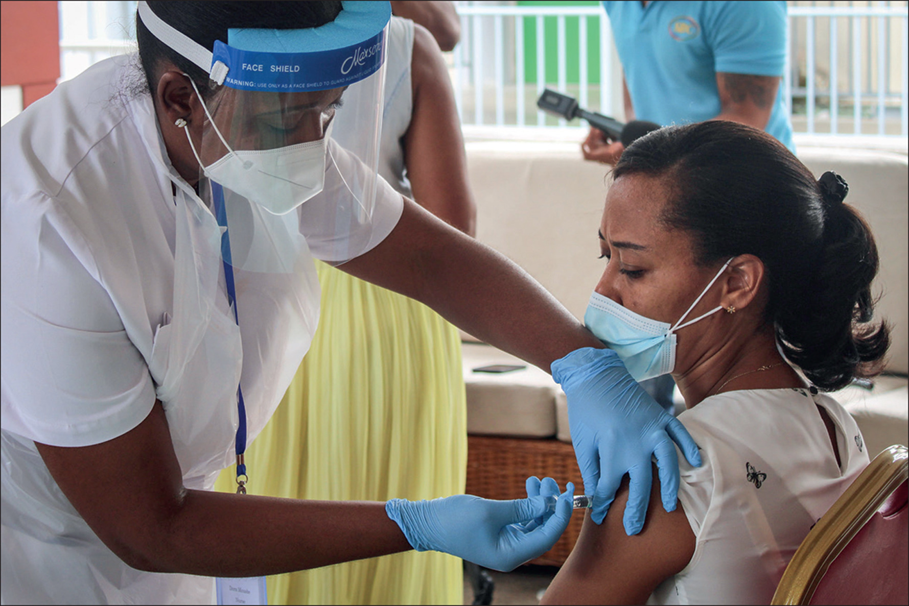{width="600"}

<figcaption>

**Image:** Lancet Infectious Diseases

</figcaption>

</figure>

  **What can be done to address COVID-19 vaccine inequity?**

COVID-19 vaccine inequity will have a lasting and profound impact on socio-economic recovery in LMICs. To provide vaccination to 70% of the population, HICs must boost their healthcare spending by an average of 0.8%, whereas LMICs must boost healthcare spending by 56.6%.

Three strategies could potentially improve the dire situation of COVID-19 vaccine inequity in LMICs\

1.  **Bilateral donation of COVID-19 vaccine**. HICs such as the United States have pledged to donate 1.1 billion doses to other countries. But deliveries so far fallen drastically short of pledges.

2.  **Multilateral donation of COVID-19 vaccine.** Multiple countries have pledged to donate COVID-19 vaccine to Gavi and the WHO, although similar to the U.S. the actual deliveries are well behind schedule.

     

    {width="500"}

    <figcaption>

    **Figure 3. Lagging COVID-19 donations by high-income countries**. Source: Vox media.

    

    </figcaption>

    </figure>

     

3.  **Creation of manufacturing capacity in LMICs**. Africa consumes 25% of the world's vaccines, but do not manufacture any of them. Access to vaccines could be improved if some of the manufacturing could be moved to the African continent. This would require a temporary intellectual property (IP) waiver for COVID-19 vaccines.[@ErfaniEtAl2021a] The waiver would prevent companies that hold the IP for COVID-19 vaccines from blocking vaccine production in other countries on the grounds of IP and allow LMICs to produce COVID-19 medical goods locally and import or export them expeditiously. This IP waiver has been supported by the World Trade Organization and several nations, but faces stiff political and pharmaceutical-industry industrial opposition.

No agency is mandated to finance and strengthen manufacturing capacity for vaccines, therapeutics, and diagnostics. Expanding regional capacity for key platform technologies (e.g., monoclonal antibodies and mRNA) to avoid reliance on a select few manufacturers and fortify supply systems should be a priority and will be essential for preparation for future pandemics. It requires transfer of highly specific and specialised technology and know-how, in coordination with regulatory oversight, robust participation of vaccine developers, and application of good, consistent, laboratory biological manufacturing practices, and addressing financial sustainability of such facilities. Given the large challenges, a strong system is required to accelerate progress. Platforms and tools to enable technology transfer, such as the COVID-19 technology access pool [(C-TAP)](https://www.who.int/initiatives/covid-19-technology-access-pool) and the [WHO vaccine technology transfer hub](https://www.who.int/news-room/articles-detail/establishment-of-a-covid-19-mrna-vaccine-technology-transfer-hub-to-scale-up-global-manufacturing) have not been effectively used. The intellectual property right TRIPS waiver proposed by South Africa and India was not supported by several high income countries.

Recently, some progress has been made in this area with approval of mRNA vaccine capability in South Africa. A new COVID-19 vaccine developed at Baylor College of Medicine in Houston, Texas was also recently approved/licensed for COVID-19 [designed specifically for global health](https://www.scientificamerican.com/article/a-covid-vaccine-for-all/)- i.e. the vaccine is produced using technology that has been employed worldwide for decades, meaning that manufacturing processes are generally already well-known and won't require a steep learning curve like the one needed for the scale-up of mRNA, adenovirus and protein particle vaccines.

This strategy is similar to the mechanism of the [Medicines Patent Pool] described below.

4.  **Improvements in allocation and delivery of vaccines.** Countries often receive notice on vaccine allocation without actual knowledge of when doses will arrive. This makes the planning of vaccination difficult and slows down the preparation for vaccinations, including the use of funds from the World Bank and other institutions. It was essential that countries were well-prepared when the planned large quantities of doses arrives in late 2021 and across 2022. The infrastructure for vaccination in many LMICs is already inadequate, as already shown by the 19.7 million under-vaccinated infants globally, most of whom are in these countries. Many LMICs, particularly in Africa, are experiencing substantial difficulties with distribution, administration, and uptake (including from vaccine hesitancy). High level political leadership on vaccine supply and deployment have not taken place at global level despite their critical importance for exiting this health crises.

### Access to SARS-CoV-2 testing in LMICs {.unnumbered}

Relatively less attention has been directed on improving diagnostic SARS-CoV-2 testing in LMICs. Many countries lack of a country-based testing plan and have limited access to molecular (PCR) and even simple antigen (lateral flow) tests or serology. This creates challenges for tracking new cases and understanding the current epidemiology of infections in many regions. Other countries have adopted diagnostic algorithms that test only selected patients based on pre-existing diseases or meet a standard case-definitions based on symptoms. The presentation of these symptoms overlaps with many febrile illness that are endemic in these countries.

### Infection control in LMICs {.unnumbered}

The WHO recommends infection control interventions to reduce the risk of transmission, in particular, avoiding close contact with people suffering from acute respiratory infections, frequent handwashing especially after direct contact with infected people or their environment. Worldwide, governments have established regulations that require social distancing, the closure of non-essential businesses, travel restrictions and, in many cases, quarantine. Although these measures were necessary for public health, social restrictions are difficult to realize in LMICs due to money-related livelihood problems. A complete commercial shutdown like those imposed in China, Europe, or the United States may not be feasible from some residents of LMICs when a day without work is tantamount to a day without food.

The procurement of personal protective equipment (PPE) including masks and protective faceshields/gowns is also a challenge. In emergency situations, raincoats and windjackets are often used as gowns, while swimming caps, goggles, and transparent paper were used as PPE. Healthcare facilities do not have the necessary space and resources to screen and treatment of COVID-19 patients separate areas and patients devoted to non-COVID-19 healthcare, facilitating the spread of the infection.[@PasqualeEtAl2021]

### Intensive care units (ICUs) in LMICs {.unnumbered}

The number of hospital beds and health workers is generally lower compared to that in HICs. The [WHO reports](https://www.who.int/data/gho/data/indicators/indicator-details/GHO/hospital-beds-(per-10-000-population)?bookmarkId=57250f95-5dcc-4a57-84d7-1b2faddeff80) only 0.8 hospital beds per 1000 people in LICs and 2.3 in LMICs. Surveys indicate that 90% of LICs have fewer than 10 medical doctors per 10,000 people, compared to only 5% of HICs. Up to 93% of LICs have fewer than 40 nursing personnel per 10,000 people, compared to only 19% of HICs.

The number of ICU beds is insufficient with respect to the population of LMICs.[@PasqualeEtAl2021] The most recent data available from the WHO indicate that Africa has fewer than 5000 ICU beds, corresponding to five beds per one million people. In Europe, by comparison, there are 4000 beds per one million people (800-fold difference).

ICUs in LMICs are more likely to have equipment that is old and poorly serviced. Mechanical ventilators tend to be older, and many hospitals may not have oxygen or medical gas to drive them. Equipment maintenance may be inadequate, and funding for capital development is limited. When funding is available, the procurement systems are often plagued by corruption, leading to a fraudulent assignment. Furthermore, long distances and high transportation costs commonly result in delayed presentation of critically ill patients.

Laboratories are often located in the capital cities, so that early diagnosis and sample analysis turnaround may be delayed.

## ACCESS TO COVID-19 Tools Accelerator (ACT) {.unnumbered}

Access to COVID-19 therapeutics (i.e. oxygen, antiviral therapies, IL-6 inhibitors, monoclonal antibodies) have not yet received the same financial and political commitments as vaccines. As waning immunity and potential emergence of vaccine resistance among new variants may compromise the efficacy of vaccines, access to therapeutics can play an important complementary role in disease control. The Access to COVID -19 Tools Accelerator (ACT-A) is a multilateral coordination mechanism set up to accelerate development, production, and equitable access to COVID-19 tests, treatments, and vaccines globally. The concept brings together governments, scientists, businesses, civil society, philanthropists and global health organisations.

Similar to COVAX, ACT-A has thus far fallen short of its expectations. As discussed above, COVAX, which is essentially the vaccine pillar of ACT-A, failed to meet the relative modest goals of 20% vaccination. Oxygen therapy, an essential treatment in severe cases, has not been strategically prioritised or stockpiled. Testing did receive political attention but has been a bottleneck in many countries.

Identifying inexpensive, widely available, and effective therapies against COVID-19 is, therefore, of great importance. Current established effective and inexpensive therapies are largely limited to corticosteroids (dexamethasone, budesonide). However, access to potent anti-inflammatory agents such as tocilizumab, or the antivirals remdesivir, manuprivir, or recently approved ritonavir/nirmatrelvir in the future seems possible.

<figure>

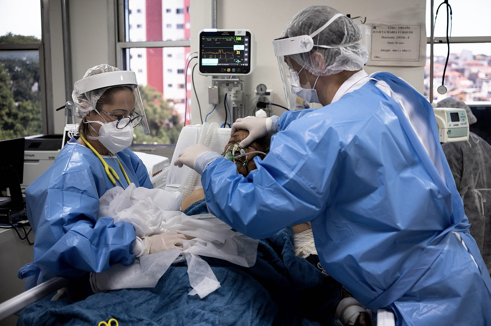{width="600"}

<figcaption>

**Image:** World Health Organization

</figcaption>

</figure>

## Medicines Patent Pool {.unnumbered}

The [Medicines Patent Pool (MPP)](https://medicinespatentpool.org/) is a United Nations-backed public health organisation working to increase access to, and facilitate the development of, life-saving medicines for LMICs. Through its innovative business model, MPP partners with civil society, governments, international organisations, industry, patient groups, and other stakeholders, to prioritise and license needed medicines and pool intellectual property to license the generic manufacture and the development of new formulations in developing countries.

**How does it work?** MPP operates as a non-profit voluntary licensing mechanism through partnerships with originator pharmaceutical companies who develop innovative medications (i.e. more effective and less toxic) but are still patent protected.

<figure>

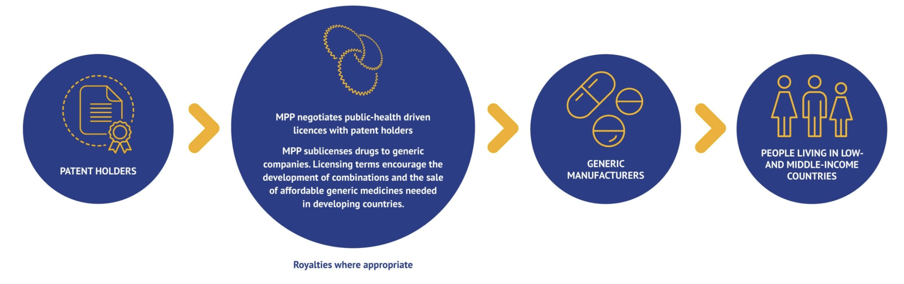{width="600"}

<figcaption>

**Figure 4. How the Medicines Patient Pool licences medicines for public health.**

</figcaption>

</figure>

MPP negotiates licences with patent holders (originator) and sub-licenses rights to manufacture and distribute the drug in the country of interest to generic manufacturers, sometimes in exchange for royalties to the original innovator. In turn, the MPP ensures that the drugs are appropriately registered in the country, there is adequate competition for production of the medication (to keep prices low and prevent a monopoly), and promotes rapid uptake and utilization in the health through communication and agreements with governmental, medical and patient advocacy groups.

The advantages of the MPP model are three fold:

1.  Innovators have their drug manufactured and distributed in LMICs using a proven mechanism with oversight working with established and reputable generic manufacturers and receive royalty payments
2.  Generic companies have access to manufacture and distribute innovative medicines that are still on patent
3.  Patients get access to affordable and more effective medications that saves lives

<figure>

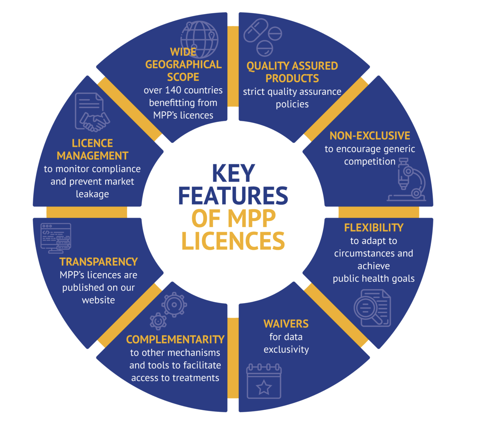{width="600"}

<figcaption>

**Figure 5. How the Medicines Patient Pool licences medicines for public health.**

</figcaption>

</figure>

For an excellent explanation of the how the Medicine Patent Pools works, see this explanation by Greg Martin: <https://www.youtube.com/watch?v=FnVJPQ1ZINw>

### MPP and {.unnumbered}

The MPP created a mRNA Vaccine Technology Transfer Hub in July 2021. The purpose of the hub was to increase access to mRNA vaccines made closer to home by establishing manufacturing capacity in Africa using a technology transfer hub model to ensure sustainable vaccine security in future pandemics. The first COVID-19 mRNA vaccine technology transfer hub has been established in South Africa. The MPP has also entered into license agreements agreements for Merck's molnupiravir and Pfizer ritonavir/nirmatrelvir oral COVID-19 therapies. The MPP has also licensed an ELISA antibody technology for serologic testing

### HIV and AIDS {.unnumbered}

Today, only a third of the people requiring treatment for HIV/AIDS have access to therapy. Drug resistance means that new drugs are required to treat the condition, but these are often unaffordable for the most affected regions. The MPP has signed agreements with ten patent holders for 13 HIV antiretrovirals and a technology for injectable long-acting HIV drug combination technology. These urgently-need antivirals are now being distributed at affordable prices in some of the hardest-hit regions by HIV.

### Viral hepatitis {.unnumbered}

Around 58 million people live globally with hepatitis C (HCV), many of them in LMICs, with the vast majority remaining undiagnosed and untreated. New direct-acting antivirals (DAA) that are effective across all major HCV strains can cure millions. Yet, approximately 84% of the people infected with HCV are not receiving treatment. Around 290,000 people die each year from hepatitis C, mostly from cirrhosis and liver cancer. Direct-acting antiviral medicines can cure more than 95% of patients. The MPP works with generic partners to speed the development and distribution of these new treatments that can eliminate the virus through a short course of oral therapy in regions with a high HCV burden.

MPP signed licence agreements for three hepatitis C treatments: daclatasvir (DAC) in 2015, ravidasvir (RAV) in 2017 and glecaprevir/pibrentasvir (G/P) in 2018.

MPP has also secured licenses for tenofovir disoproxil fumarate (TDF) and tenofovir alafenamide (TAF), benefit people living with HIV as well as people living with chronic hepatitis B virus (HBV), a disease affecting 296 million globally. The majority of people with hepatitis B live in LMICs.

### Tuberculosis {.unnumbered}

Tuberculosis (TB) is a global pandemic affecting around 10 million people worldwide. In 2018, the disease caused 1.5 million deaths, and it is the leading killer of people living with HIV. Almost 90% of TB deaths occur in LMICs. The *WHO's Global TB Strategy* sets ambitious targets aimed at reducing TB deaths by 95% between 2015 and 2035, and to end TB. To meet these targets, faster acting, better therapies to treat TB are needed, especially for multidrug-resistant TB (MDR-TB). The MPP's focus is to secure access to new treatments for MDR-TB and drug-susceptible tuberculosis. Th MPP also facilitates the development of new regimens by licensing TB drugs that are still under development. In early 2017, MPP signed its first agreement with the Johns Hopkins University. This agreement was to facilitate the clinical development of sutezolid, a promising investigational treatment for tuberculosis. It was followed by a second agreement with Pfizer in October 2019 to access Pfizer's preclinical, phase I and phase IIa clinical study data and results on sutezolid.

### Is the Medicines Patient Pool Working? {.unnumbered}

As of December 2021, the MPP has signed agreements with 13 patent holders for thirteen HIV antiretrovirals, one HIV technology platform, three hepatitis C direct-acting antivirals, a tuberculosis treatment, two long-acting drug-dosing technologies, two experimental oral antiviral treatments for COVID-19 and a COVID-19, serological antibody and antigen diagnostic tests. A total of 25 generic manufacturers and product developers have now signed MPP sub-licensing agreements.

Generic competition is making a difference in fostering lower prices and improving treatment coverage. Generic partners have distributed 49.71 million patient-years of HIV and hepatitis C products, saving international purchasers USD 920 million (January 2012-December 2020).

<figure>

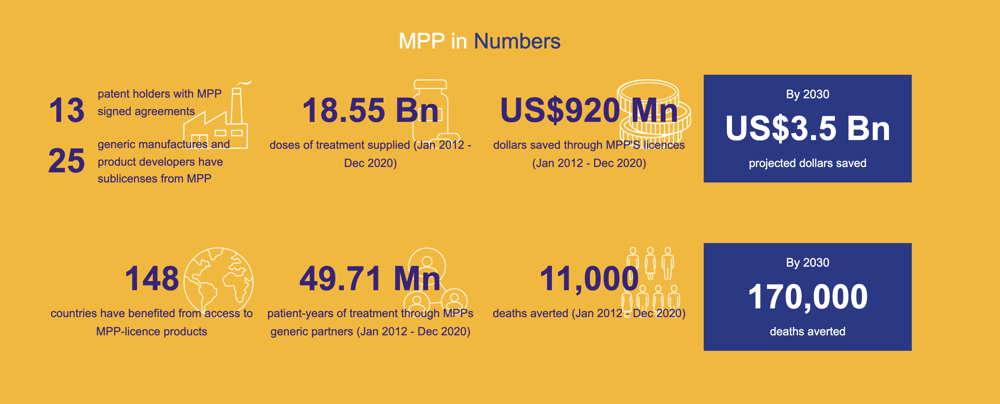{width="600"}

<figcaption>

**Figure 6. Impact of the Medicines Patent Pool.** Source: medicinespatentpool.org

</figcaption>

</figure>

## Counterfeit Medications {.unnumbered}

What is a fake medicine?

Interpol defines a counterfeit or substandard medicine as one that differs from the authentic version of the vaccine by:

-   Containing too much or too little of one or more ingredients, or containing different ingredients

-   Claiming to have different properties or side effects

-   Having a different shape, size, taste, or colour

-   Being not correctly labelled or not labelled at all

-   Having an out-of-date or missing expiry date

-   Not including information on how to store the medicine

-   Having packaging that looks poorly constructed, is labelled with spelling or grammar errors, or appears to have been interfered with

WHO estimates that up to 1% of medicines available in HICs are counterfeit. In LMICs, **1 in 10 medicines are thought to be either substandard or falsified**. Nearly 170,000 children die annually of falsified medications used in the treatment of pneumonia. Substandard or fake anti-malarial medications are estimated to cause 116,000 deaths annually in sub-Saharan Africa. The limited data available on this issue means the known figures almost certainly represent an underestimation.

**Antibiotics account for 28% of counterfeit medicines globally.**[@DelepierreEtAl2012] Over 75% of counterfeit antibiotics come from South-East Asia and their destination is mainly emerging countries (South-East Asia: 44%; sub-Saharan Africa: 30%; Europe, North America: 9%; others: 16%). Counterfeit antibiotics are antibiotics that have been commonly used for years (beta-lactams: 50%; quinolones: 12%; macrolides, lincosamides). The main counterfeit formulations are oral medications (77%) whereas injected drugs account for only 17% of counterfeit formulations, and eye drops and ointments 6%.

According to a report by the Medicine Quality Research Group, Centre of Tropical Medicine & Global Health, Nuffield Department of Medicine and the University of Oxford, the black market in fake medicines has grown by more than 400% during the COVID-19 pandemic.[@MedicineQualityResearchGroup2021] **There is a growing online trend of fake websites that mimic real pharmaceutical websites where COVID-19 vaccines are sold up to \$1000 and vaccine certificates for \$200.** Moreover, the "trickle down" of vaccine donations from richer countries has left populations, and particularly health worker in LMICs, vulnerable to infection with some turning to unlicensed vendors for vaccines.

WHO has warned that the vaccine equity gap continues to be exploited by organised criminal groups for profit as they pivot from personal protective equipment and diagnostics towards vaccines. Given that fake vaccine cards and passports are becoming a profitable business, authorities have urge citizens not to share photos of them on social media. Therefore, the importance of improved equitable vaccine roll-out becomes even more critical to protect poorer countries against the proliferation of falsified medicines.

The globalisation of the pharmaceutical industry has made tracking fake and substandard products more challenging.[@Srivastava2021] Active drug ingredients may come from China, while the product may be manufactured in India and be packaged in a third country before being shipped through Dubai. It might then be repackaged and shipped to yet another country to take advantage of exchange rates. These many steps provide more opportunities for fraud than if all manufacturing and packaging occurred ina single country where the process could be inspected and traced.

<figure>

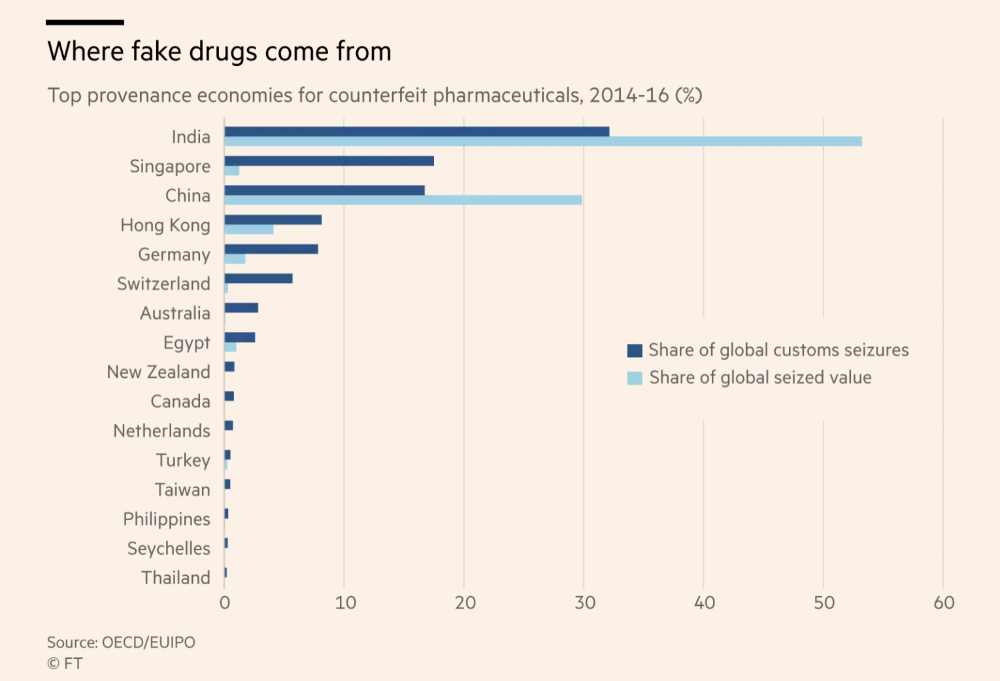

<figcaption>

**Figure 7. Sources of counterfeit drugs.** Source Financial Times

</figcaption>

</figure>

Counterfeit drugs are manufactured in countries which cannot guarantee good purchase practices and which have either too few or no regulation for distribution circuits. The lack of control, or their lax security or non-effectiveness, support the distribution of counterfeit drugs in national or illegal distribution circuits. This weakness is enhanced by the insufficiency of human and financial resources dedicated to control activities.[@DelepierreEtAl2012a] Even if the pharmaceutical industry massively invests in the research of tools or technologies for the prevention and detection of counterfeit drugs, international collaboration required to guarantee the application and the development of such mechanisms is often lacking.

The legal systems of most countries do not take into account the public health issue of counterfeit drugs and the crime is punished as a similar level as counterfeiting of luxury goods, as laws having been conceived more to protect brands According to The International Drug Industry Federation, the counterfeit drug market is 25 times more lucrative for counterfeiters than that of heroin and 5 times more than that of cigarettes, with substantially lower criminal penalties for perpetrators who are caught.

**How to spot a counterfeit medicine according to Interpol: looking for the "six Ps" is a starting point to identify a falsified medical product:**

-   **Place**---Never buy medicines from unknown websites or in a marketplace. If you are unsure about a supplier's credentials, check the list of registered dispensaries at your local health regulatory body
-   **Prescriptions**---Only buy medicine that has been prescribed by your doctor or healthcare professional. When buying online, make sure the website requires you to present a prescription. Do not buy from websites that offer prescriptions on the basis of questionnaires or do not have a contactable pharmacist
-   **Promises**---Be wary of pharmacies that offer "too good to be true" promises. False promises to watch out for are "cures all types" of a major illness, "money-back guarantee", "no risk", or "limited supply---buy in advance"
-   **Price**---Check the price against products you usually buy or with reputable providers. If it is substantially cheaper, it is likely to be a fake
-   **Privacy**---The trade in fake medical products has been linked to credit card fraud and identity theft. Do not reveal any personal information beyond appropriate medical details
-   **Product**---Compare the medicines with your usual prescription

### Specific problems with counterfeit antibiotics {.unnumbered}

Counterfeit drugs are often commonly "old" antibiotics such as beta-lactams, tetracycline, trimethoprim, sulfamethoxazole, and chloramphenicol; the latest generations are rarely counterfeited. Most of the antibiotics counterfeited are on the WHO essential drugs list. The most common types of counterfeiting include:[@DelepierreEtAl2012a]

-   **Counterfeits without active ingredient (most common)**. The active ingredient is replaced by cheap substances such as flour in the oral formulations, or saline or tap water in injectable formulations.
-   **Bad quality counterfeits.** They medicine may contain excipients or active ingredients un-adapted for the drug. Products may contain toxic or pathogenic chemical impurities. For example, counterfeit injectables have been found to contain methanol, a potentially lethal product for humans at low doses.
-   **Counterfeits with inadequate active ingredient.** These concern real drugs, less expensive or outdated, first collected, opened, then repacked. It works both ways; an antibiotic may be replaced by the active ingredient of another class and vice versa. For example, in Nigeria, a counterfeiter had reconditioned diazepam syrup (benzodiazepine) and had sold it asan antibiotic under the original name of co-trimoxazole
-   **Counterfeit packaging.** The counterfeiting may be made at various levels. False representation of identity is commonly used, either partially or totally by copying the packaging of another marketed product. The brand name may be modified to try to escape laws on infringing intellectual property

Taking counterfeit antibiotics may induce adverse effects because of a different active ingredient or because of potentially toxic chemicals or contaminants. **The counterfeiting of antibiotics directly promotes the emergence of acquired bacterial resistance against antibiotics if dosages have expired or if the formulations contains an inadequate drug dose.**

+----------------------------------------------------------------------------------------------------------------------------------------------------------------------------------------------------------------------------------------------------------------------------------------------------------------------------------------------------------------------------------------------------------------------------------------------------------------------------------------------------------------------------------------------------------------+
| From <https://fightthefakes.org>                                                                                                                                                                                                                                                                                                                                                                                                                                                                                                                               |
|                                                                                                                                                                                                                                                                                                                                                                                                                                                                                                                                                                |
| The day Victoria Amponsah was diagnosed with malaria she also learned that she was two months pregnant. She left the hospital with a prescription for an anti-malarial drug and, like patients anywhere else in the world, went to a local pharmacy believing that the medicine she purchased would treat her condition. Victoria bought what she thought was a genuine, effective drug, but that was not the case. Her condition quickly worsened and within hours she was admitted to the hospital, learning later that she had been sold counterfeit pills. |
+----------------------------------------------------------------------------------------------------------------------------------------------------------------------------------------------------------------------------------------------------------------------------------------------------------------------------------------------------------------------------------------------------------------------------------------------------------------------------------------------------------------------------------------------------------------+
| Fortunately, Victoria and her baby survived the trauma and successfully fought off malaria, but this would not be her only personal encounter with fake medicine. At the end of her healthy pregnancy, she was deceived by a fake version of oxytocin, disguised in an official-looking package. Within thirty minutes, Victoria started sweating, shaking, vomiting and bleeding. She was in the hospital for two days, nearly lost her baby and had to return to the hospital every week after the incident for some time.                                   |
+----------------------------------------------------------------------------------------------------------------------------------------------------------------------------------------------------------------------------------------------------------------------------------------------------------------------------------------------------------------------------------------------------------------------------------------------------------------------------------------------------------------------------------------------------------------+
| As Victoria knows all too well, fake medicine can threaten your health or even claim your life. According to the World Health Organization (WHO), about 700,000 people die every year from fake malaria and tuberculosis drugs alone. The WHO also estimates that 25-60% of the medicine supply in developing countries is either substandard or counterfeit. To wathc a video describing Victoria's story, see the following YouTubeVideo produced the US Pharmacopia: <https://www.youtube.com/watch?v=6AMOn00dQsU&t=64s>                                    |
+----------------------------------------------------------------------------------------------------------------------------------------------------------------------------------------------------------------------------------------------------------------------------------------------------------------------------------------------------------------------------------------------------------------------------------------------------------------------------------------------------------------------------------------------------------------+

### How can drug counterfeiting be reduced? {.unnumbered}

The International Medical Products Anti-Counterfeiting Taskforce was created in 2006 by the WHO with the objectives of preventing the manufacture and the sale of counterfeit drugs, and to facilitate communication and collaboration between all the partners to coordinate the actions implemented to monitor and eliminate drug counterfeiting. The group has worked in 4 areas to address drug counterfeiting:

1.  Development of guidance documents for principles and elements to include in national laws against the counterfeiting of medical product.
2.  Implementation of regulations. It gives advice to national authorities to improve controls, tools for national evaluation, and models of procedures to deal with counterfeit drugs.
3.  Training of personnel in charge of control of drug counterfeiting and collaboration between the various authorities of each country. For example, [Operation Storm II](https://www.interpol.int/News-and-Events/News/2010/INTERPOL-applauds-Southeast-Asia-Operation-Storm-II-s-success-in-disrupting-trade-of-counterfeit-medical-products) was coordinated by Interpol and the West-Pacific Regional Office (WPRO) of the WHO The platform improved collaboration between the police, the customs, and the drug regulatory authorities of international organizations and private sector. This operation led to 30 arrests and confiscating 12 million counterfeit drugs, including antibiotics, between July and November 2009. This action also led to closing 100 illicit pharmacies and sales points.
4.  Development of technology for tracking and monitoring prescriptions to ensure authenticity.
5.  Improving health-care provider and patient awareness. created model supports to sensitize healthcare professionals and patients about warning signs and risks of counterfeit medications.

**In 2019, The European Medicines Agency instituted new regulations for drug supply chain traceability and verification systems-"track and trace" to mitigate the risk of shortages and fight production and marketing of counterfeit drugs.** The regulation also required new safety features (a unique identifier both in human readable format and encoded in 2D data matrix (such as RFID barcodes, holograms) as well as an anti-tampering devices to be placed on individual packs of virtually all prescription medicines, and related compliance reporting.

The European Council also set up the international convention Medicrime. This convention was adopted by the European Council on December 8, 2010, and signed on October 28, 2011. It prosecutes the counterfeiting of medical products and is thus the first specific judicial instrument in the domain of penal law for counterfeiting medications.

In some African countries, counterfeiting is a commercial crime but only penalized by a small fine. In India, counterfeiters can be sentenced to of 3 years of prison at most and a 108 dollar fine. But in China, counterfeiters can be sentenced to death. The implementation of inspection groups and the deployment of a prevention force allow detecting more effectively counterfeiters and dismantling the various counterfeiter networks. Among the various available prevention forces, customs are the most involved and responsible for 90% of confiscation of all kinds of counterfeiting in Europe and 70% worldwide

The counterfeiting of drugs, and especially that of antibiotics is a true public health issue.

## Summary: COVID-19 and lessons for the AMR crises {.unnumbered}

The COVID-19 pandemic, like the 1918 flu pandemic,is an all-encompassing, economic, political, and social crisis. COVID-19 has illustrated the importance of development, testing, and deployment of treatments, vaccines, and diagnostics to prevent and treat pandemic diseases. The lessons of the COVID-19 pandemic are both a cause for hope and concern. Whatever the eventual outcome, at least 5 initial lessons from the pandemic can be applied to the slower-moving, silent but potentially more severe problem of antibiotic resistance.[@GlobalAntibioticResaerchandDevelopmentPartnership2020]

1.  **Investments in preparedness are essential and cost-effective, including research and development of new treatments and vaccines.** The [2020 annual report of the GPMB](https://apps.who.int/gpmb/assets/annual_report/%20GPMB_AR_2020_EN.pdf) notes the 'COVID-19 pandemic will trigger the biggest hit to global economic growth since World War II, with economic costs in the order of tens of trillions of dollars over the next five years.' Even if investments in preparedness run into the billions, it would 'take 500 years to spend as much on investing in preparedness as the world is losing due to COVID-19.

2.  **Collaboration and international coordination are critical to address a pandemic.** COVID-19 has clearly shown that a single country cannot solve the challenges of a fast-moving pandemic on its own. This includes the identification and development of new medical countermeasures to prevent, test and treat; understanding how the virus is evolving; the execution of worldwide clinical trials in countries with active outbreaks; and the production of adequate supply to meet the needs of all. Without the flexibility to conduct clinical trials in countries where the pandemic is intensifying, it will be difficult to test health tools in a timely manner.

3.  **The availability of medical treatments and vaccines is insufficient because market incentives are neither sufficient nor appropriate to ensure access on a global scale.**

    Since most pandemics are uncertain events that may never occur, or will materialise when unexpected, the normal incentives that are intended to promote the development of new medicines, vaccines, and diagnostics within the 'free market' are not sufficient to encourage companies to prevent, anticipate or respond without the active intervention and support (especially financial resources) of governments. Thus we need to think of antibiotics as a "fire extinguisher" for a future AMR pandemic.

4.  **Equitable and affordable access to medical therapies is an essential element of a comprehensive and effective pandemic response.** Equitable access to these vital health tools has become a major challenge during the pandemic. Efforts to encourage coordination and collaboration to facilitate equitable access to countermeasures have been undermined repeatedly. This may be due to two factors: (a) anticipated or actual scarcity of supply, whether for personal protective equipment (PPE), treatments, testing equipment and tests, and future vaccines and (b) the financing of new vaccines and treatments primarily by a small number of largely high-income countries, which has allowed them to secure privileged access to new countermeasures.

    As the Global Preparedness Monitoring Board ([GPMB](https://apps.who.int/gpmb/assets/annual_report/%20GPMB_AR_2020_EN.pdf)) noted in its 2020 report, there was an 'absence of a pre-established multilateral agreement to share limited countermeasures', which in its estimation will threaten to 'prolong the (COVID-19) pandemic'. At the outset of the pandemic (and even now for many countries for diagnostics and treatments), there was no pooled procurement facility to pool demand for vaccine and therapeutics, improve sharing of limited supply and encourage balance between supply and demand. Breakdowns of coordination and collaboration have impacted access to everything from PPE to oxygen, while many countries faced delays waiting for access to new treatments, diagnostics, and vaccines approved during COVID-19.

5.  **Inequitable access to medical therapies can undermine the trust many countries have in the "international system."** The challenges of access to countermeasures during the COVID-19 pandemic could also mean governments turn inwards as a protective measure against the shortcomings and inequities of cooperation. Even if there is greater cooperation, it will conflict with inward looking approaches for countries that do not want to fully rely upon or do not trust the 'international system'.

    Thus, countries may rely on shortened supply chains, including end-to-end production within a country, to meet domestic needs. They may also introduce regional approaches to pandemic response, production, supply and pooling of demand, such as the recently established Africa Medical Supplies Platform. These kind of regional efforts should be welcomed to ensure that countries can meet their own needs and ensure there is equitable access to medical supplies worldwide. Where possible, such efforts should be aligned with or integrated into global mechanisms that ensure equitable access.

The impact of COVID-19 pandemic represents a turning point to improve the global response to pandemic, including AMR. GARDP has proposed 5 measures that could strengthen domestic and global responses to AMR.

1.  Recognize and urgently address the silent pandemic of drug-resistant infections.

2.  Invest in the development of medical countermeasures as a critical element of pandemic preparedness

3.  Ensure that access to diagnostics, treatment and vaccines for all is a cornerstone of pandemic preparedness and response

4.  Expand global cooperation across geographies and sectors and within a ONE-Health framework.

5.  Ensure LMICs are equal partners in a comprehensive global response Solutions that have been pioneered by countries should be recognized and integrated into the pandemic preparedness response.

\newpage

## References {.unnumbered}
